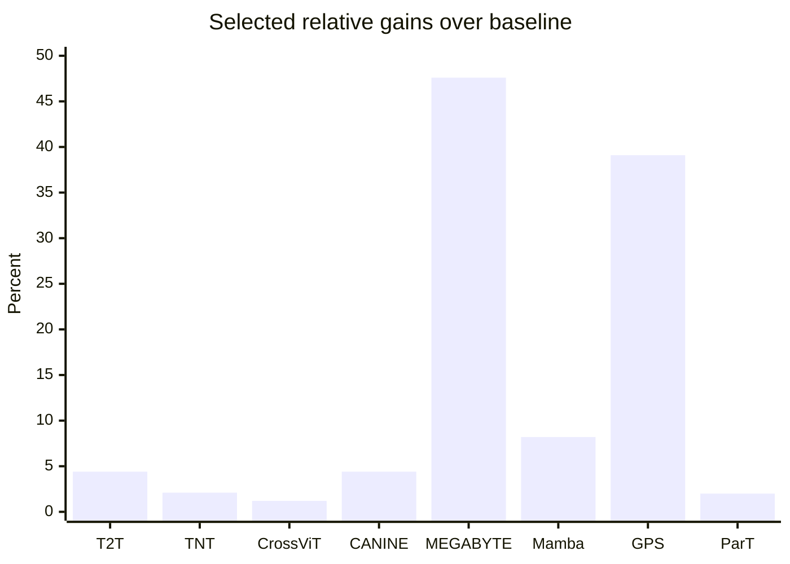

# Where Simple Transformers Get Beaten

## Executive Summary

Across domains, the biggest failures of relatively simple transformer baselines usually do not come from “transformers being bad” in the abstract. They come from a mismatch between the data’s natural structure and the model’s tokenization or inductive bias. When researchers add the right structure back in, through multi-scale tokenization, local compression, graph or geometry bias, pairwise relations, or hybrid local-plus-global computation, the gains can be substantial. The clearest quantitative examples in the literature include T2T-ViT beating ViT-S/16 by **+3.4 ImageNet top-1** while using **55.8% fewer parameters** and **52.5% fewer MACs**, MEGABYTE reducing PG19 test perplexity from **69.4 to 36.4** against a byte-level transformer, GraphGPS raising PascalVOC-SP F1 from **0.2694 to 0.3748** over a pure graph transformer baseline, and ParT raising JetClass accuracy from **0.844 to 0.861** over ParticleNet while also using fewer FLOPs. citeturn1search10turn18view0turn26view0turn31view0turn14view4

The strongest recurring design pattern is not “replace attention.” It is **local reasoning first, then compression or pooling, then global reasoning**. T2T-ViT, TNT, CrossViT, MEGABYTE, GraphGPS, Point Transformer, and ParT all follow some version of that recipe. In other words, the winning move is often to choose a tokenization level that better matches the object hierarchy in the data, then let the model reason at multiple scales instead of forcing everything through one flat token sequence. citeturn1search10turn18view0turn16view2turn26view0turn31view0turn6view2turn13view0

There are also important counterexamples. In tabular data, feature-token transformers are competitive and often more universal than plain MLP-style deep models, but **tuned GBDTs still beat FT-Transformer on several datasets**, including Adult, California Housing, and Yahoo. The FT-Transformer paper is explicit that there is still “no universal solution” between deep tabular models and GBDTs. That is a useful warning for particle-physics work: a more expressive tokenization is promising, but an added transformer level does not automatically dominate strong structured baselines. citeturn9view0turn32view1

For your particle-tokenization idea, the most relevant takeaway is that the literature repeatedly rewards **hierarchical tokenization aligned with natural objects**. Vision papers show gains when patches are re-tokenized into sub-patches or multi-scale branches. NLP papers show gains when characters or bytes are locally compressed before global sequence modeling. Graph and point-cloud papers show gains when local neighborhoods and structural relations are encoded explicitly. ParT itself wins by adding particle-pair information into attention instead of relying on plain token embeddings alone. That makes your “within-particle feature negotiation, then particle-level attention” idea look much more like a natural next step than an odd detour. citeturn18view0turn16view2turn26view0turn25view3turn31view0turn6view2turn14view1

## Comparison Table

The table below focuses on direct or near-direct comparisons where the paper reports exact benchmark numbers. For perplexity, RMSE, and MAE, lower is better.

| Domain | Dataset | Baseline transformer | Competing model | Metric | Baseline score | Competitor score | Params / FLOPs where reported | Relative delta | Citation |
|---|---|---|---|---:|---:|---:|---|---|---|
| Vision | ImageNet-1K | **ViT-S/16**, fixed 16×16 patch tokens | **T2T-ViT-14**, progressive token-to-token aggregation | Top-1 acc | 78.1 | 81.5 | 48.6M / 10.1G → 21.5M / 4.8G | **+3.4 pts** | **+4.4%** | citeturn1search10 |
| Vision | ImageNet-1K | **DeiT-S**, single-scale patch tokens | **TNT-S**, inner sub-patch plus outer patch transformers | Top-1 acc | 79.8 | 81.5 | 22.1M / 4.6G → 23.8M / 5.2G | **+1.7 pts** | **+2.1%** | citeturn18view0turn18view1 |
| Vision | ImageNet-1K | **DeiT-B**, single-scale patch tokens | **CrossViT-18†**, dual patch sizes with cross-attention fusion | Top-1 acc | 81.8 | 82.8 | 86.6M / 17.6G → 44.3M / 9.5G | **+1.0 pt** | **+1.2%** | citeturn16view2turn16view3 |
| Vision | COCO test-dev | **Swin-B‡**, hierarchical windowed transformer | **ConvNeXt-B‡**, pure ConvNet with modernized hierarchical design | Box AP | 53.0 | 54.0 | 121M / 982G → 122M / 964G | **+1.0 AP** | **+1.9%** | citeturn24view0 |
| Vision | ADE20K val | **Swin-B‡**, hierarchical windowed transformer | **ConvNeXt-B‡**, pure ConvNet with modernized hierarchical design | mIoU | 51.7 | 53.1 | 121M / 1841G → 122M / 1828G | **+1.4 mIoU** | **+2.7%** | citeturn24view0 |
| NLP | TyDi QA | **mBERT**, subword WordPiece encoder | **CANINE-S**, tokenization-free character encoder with downsampling | SELECTP F1 | 63.2 | 66.0 | 179M → 127M | **+2.8 F1** | **+4.4%** | citeturn25view3 |
| NLP | PG19 | **Byte-level Transformer**, raw bytes | **MEGABYTE**, byte patches with local plus global decoder | Test perplexity | 69.4 | 36.4 | Compute-matched; byte context 2048 → 8192 | **-33.0 ppl** | **47.6% lower** | citeturn26view0 |
| NLP | The Pile plus zero-shot suite | **Pythia-1.4B**, standard decoder transformer | **Mamba-1.4B**, selective state-space model | Zero-shot average | 55.2 | 59.7 | Same size class; paper also reports **4–5×** inference throughput for similar-size Mamba | **+4.5 pts** | **+8.2%** | citeturn28view0turn27view0 |
| Tabular | Adult | **FT-Transformer**, one feature token per field in a row | **CatBoost** ensemble | Accuracy | 0.860 | 0.874 | Not reported | **+0.014** | **+1.6%** | citeturn9view0turn32view1 |
| Tabular | Yahoo | **FT-Transformer**, one feature token per field in a row | **XGBoost** ensemble | RMSE | 0.747 | 0.732 | Not reported | **-0.015** | **2.0% lower** | citeturn9view0turn32view1 |
| Tabular | Covertype | **CatBoost** ensemble | **FT-Transformer**, one feature token per field in a row | Accuracy | 0.968 | 0.973 | Not reported | **+0.005** | **+0.5%** | citeturn9view0turn32view1 |
| Graphs | PCQM4M-LSC | **GT**, node-token graph transformer | **Graphormer**, graph-aware transformer with centrality, spatial, and edge encodings | Validation MAE | 0.1400 | 0.1234 | 0.6M → 47.1M params | **-0.0166** | **11.9% lower** | citeturn10view0 |
| Graphs | ZINC | **GT**, node-token graph transformer | **GraphormerSLIM**, graph-aware transformer | Test MAE | 0.226 | 0.122 | 588,929 → 489,321 params | **-0.104** | **46.0% lower** | citeturn10view1 |
| Graphs | PascalVOC-SP | **Transformer+LapPE**, pure graph transformer | **GPS**, GatedGCN plus transformer plus structural encodings | F1 | 0.2694 | 0.3748 | Same ~500k parameter budget | **+0.1054** | **+39.1%** | citeturn31view0 |
| Point clouds | ModelNet40 | **Set Transformer**, point tokens | **Point Transformer**, local-neighborhood point attention | Overall accuracy | 90.4 | 93.7 | Point Transformer 4.9M params reported | **+3.3 pts** | **+3.7%** | citeturn7view0turn7view4 |
| Particle physics | JetClass | **ParticleNet**, particle-cloud DGCNN | **ParT**, particle tokens plus pairwise interaction-biased attention | Accuracy | 0.844 | 0.861 | 370k / 540M → 2.14M / 340M | **+1.7 pts** | **+2.0%** | citeturn14view4 |
| Particle physics | JetClass | **ParT plain**, standard MHA over particle tokens | **ParT**, pairwise-interaction MHA over particle tokens | Accuracy | 0.849 | 0.861 | 2.13M / 260M → 2.14M / 340M | **+1.2 pts** | **+1.4%** | citeturn14view1turn14view4 |

## Vision

Vision is probably the cleanest demonstration that **tokenization choice is not a detail**. Early ViT-style models used a flat grid of fixed-size image patches, but several follow-up papers won by changing that tokenization or by adding a second scale. T2T-ViT replaces one-shot patchification with progressive token aggregation and improves ImageNet top-1 from **78.1 to 81.5** while cutting parameters from **48.6M to 21.5M** and MACs from **10.1G to 4.8G**. TNT explicitly introduces a second inner token level inside each patch and improves DeiT-S from **79.8 to 81.5** at similar scale. CrossViT combines small and large patch branches and beats DeiT-B from **81.8 to 82.8** while using roughly **half the parameters and FLOPs**. Those are direct demonstrations that a better tokenization hierarchy can beat a simpler flat-patch transformer, sometimes by a large margin. citeturn1search10turn18view0turn16view2turn16view3

A second vision lesson is that **locality and hierarchy can matter more than “being a transformer.”** Swin’s shifted-window hierarchy was important because plain ViT-style global attention is awkward for dense vision tasks. But ConvNeXt then showed that, once you reintroduce the right hierarchical and local biases, a pure ConvNet can again outperform a strong hierarchical transformer baseline on COCO and ADE20K. In the reported comparisons, ConvNeXt-B‡ beats Swin-B‡ on COCO Cascade Mask R-CNN from **53.0 to 54.0 box AP** and **45.8 to 46.9 mask AP**, and on ADE20K from **51.7 to 53.1 mIoU**, at essentially the same parameter count and slightly lower FLOPs. That is a strong reminder that many transformer wins in vision are really wins for **multi-scale local-global design**, not necessarily for attention alone. citeturn15view1turn24view0turn20view0

Selected relative gains from direct baseline-to-competitor comparisons are shown below. For MEGABYTE, Graphormer, and GPS, the bars represent relative **error reduction** because the underlying metrics are lower-is-better. citeturn1search10turn18view0turn16view2turn25view3turn26view0turn28view0turn31view0turn14view4

One useful nuance is that vision also supplies negative examples for pure-transformer enthusiasm. TNT itself notes that, at the time, transformer variants were still **inferior to EfficientNet** at the top end of ImageNet accuracy, with TNT-S at **81.5** versus EfficientNet-B4 at **82.9**. So even in the domain that made transformers famous outside NLP, noticeable wins often came either from better hierarchies inside the transformer or from a non-transformer model with stronger image priors. citeturn18view0

## Language and Tabular Data

In NLP, the clearest wins over simpler transformers show up when **tokenization itself is under strain**. CANINE replaces subword tokenization with character-level processing plus aggressive downsampling, and on TyDi QA it improves over a matched mBERT baseline from **63.2 to 66.0 SELECTP F1** while using **127M instead of 179M parameters**. That is a direct result saying that a more faithful raw-text representation, if paired with local compression, can beat a conventional subword transformer. citeturn25view3turn25view0

MEGABYTE pushes the same idea further for long sequences. Instead of using one giant flat autoregressive transformer over raw bytes, it breaks bytes into patches, runs a smaller local model within each patch, and a larger global model across patches. On PG19, its compute-matched comparison to a byte-level transformer reduces test perplexity from **69.4 to 36.4**, and on long-sequence image density estimation it beats both a standard transformer and Perceiver AR at resolutions up to sequences of over **1.2 million bytes**. This is one of the strongest pieces of evidence I found for the proposition that **hierarchical local compression can beat a flat transformer very decisively** when the atomic token sequence is too long and too fine-grained. citeturn26view0

Mamba is the strongest non-transformer example in the language-modeling part of this survey. On the same training setup used for Pythia, **Mamba-1.4B** improves the zero-shot average from **55.2 to 59.7** and improves Pile validation perplexity from **7.51 to 6.80**. The paper also reports **4–5× higher inference throughput** than similar-size transformers and states that **Mamba-3B** matches transformers roughly twice its size on several evaluations. Even if one is skeptical of “transformer killers,” this is clearly a case where an attention-free sequence model beat a reasonably strong standard transformer family by a noticeable margin. citeturn28view0turn27view0

RetNet is worth mentioning as an adjacent result even though I did not put it in the main comparison table because the web text extraction exposed its speed numbers more cleanly than its exact perplexity values. The paper reports that at **7B parameters and 8k sequence length**, RetNet decodes **8.4× faster**, saves **70% of memory**, and in its summary figure claims **15.6× throughput** and **3.4× lower GPU memory** than a transformer, while presenting favorable scaling curves for language modeling. That places it in the same conceptual family as MEGABYTE and Mamba: models that try to preserve the good part of sequence modeling while avoiding the flat attention bottleneck. citeturn29view0turn30view2

Tabular data is almost the opposite story. FT-Transformer is a serious and elegant adaptation where each row’s fields become feature embeddings and attention operates at the feature level of one object. It is much stronger than older attention-style tabular baselines, and the paper argues that it is more universal than their ResNet-style neural baseline. But once hyperparameters are tuned, the authors explicitly say that **GBDTs start dominating on some datasets**. Their own Table 4 shows tuned CatBoost beating FT-Transformer on **Adult** from **0.860 to 0.874** accuracy and tuned XGBoost beating FT-Transformer on **Yahoo** from **0.747 to 0.732 RMSE**, even though FT-Transformer wins on **Covertype** from **0.968 to 0.973** over tuned CatBoost. So here the lesson is not “better tokenization fixes everything.” It is that feature-token transformers are powerful, but structured tree ensembles are still very hard to dislodge on many tabular problems. citeturn32view1turn9view0

## Graphs Point Clouds and Particle Physics

Graphs are one of the strongest pieces of evidence that **bare transformer attention over coarse tokens is usually not enough**. Graphormer improves radically over the earlier GT baseline by injecting graph-specific encodings into node-token attention. On PCQM4M-LSC, validation MAE drops from **0.1400 to 0.1234**. On ZINC, test MAE drops from **0.226 to 0.122**, a **46%** relative reduction. Those are not small tweaks. They are the payoff from telling attention about graph structure instead of asking it to rediscover that structure from node embeddings alone. citeturn10view0turn10view1

GraphGPS goes one step further and argues for a **hybrid** recipe: local message passing, global attention, and explicit positional or structural encodings. Its gains over a pure transformer baseline are dramatic on some long-range graph benchmarks. On PascalVOC-SP, **Transformer+LapPE** gets **0.2694 F1**, while **GPS** gets **0.3748** under the same rough parameter budget. The paper’s own analysis is also highly relevant to your question: on **ZINC**, global transformer attention gives essentially no gain because the task depends heavily on local substructures, while for harder long-range tasks the transformer component becomes critical. That is exactly the kind of “choose the right tokenization and reasoning scale for the task” story that matters for jets. citeturn31view0turn11view1

Point-cloud results tell a similar story, but in geometric language. A simple set-based transformer baseline is not enough. On ModelNet40, the **Set Transformer** baseline in the Point Transformer paper gets **90.4** overall accuracy, while **Point Transformer** reaches **93.7**. On ShapeNetPart, Point Transformer also reaches **86.6 instance mIoU**, and on S3DIS it becomes the first model in that paper’s comparison to pass **70% mIoU** on Area 5. The crucial difference is not merely “more attention.” It is that the attention operator is built around **local neighborhoods and positional relations between points**, rather than treating an unordered point set as generic tokens. citeturn7view0turn7view3turn7view4

Particle physics is the closest analogue to your idea, and ParT is the key result. On JetClass, **ParticleNet** reaches **0.844** accuracy with **370k parameters** and **540M FLOPs**, while **ParT** reaches **0.861** with **2.14M parameters** and **340M FLOPs**. Just as importantly, the ablation against **ParT plain** shows that adding pairwise interaction information on top of particle tokens raises accuracy from **0.849 to 0.861**, and the paper states that background rejection falls by **20–30%** for most signals when that pairwise term is removed. In other words, even within the particle-token paradigm, the strongest gains come when the model is allowed to reason with **structured particle-particle relations**, not just flat particle embeddings. citeturn14view4turn14view1turn13view0

That is exactly why ParT is so relevant to subtoken ideas. It already demonstrates that the plain “object token plus generic self-attention” formulation leaves performance on the table. Once pairwise physics features are injected, performance jumps. Your proposed next step is analogous but one level lower: instead of adding only **between-particle** structure, let the model also learn **within-particle** structure before particle-level reasoning. Cross-domain evidence says that kind of move is often where the next gain lives. citeturn13view0turn14view1turn18view0turn26view0

## Cross-Domain Analysis and Takeaways

Looking across the domains, four mechanisms explain most of the wins. The first is **better token granularity**. T2T-ViT, TNT, CrossViT, CANINE, and MEGABYTE all improve performance by changing what counts as a token or by adding a second token scale. The second is **locality before globality**. Swin, Point Transformer, GraphGPS, and MEGABYTE all introduce a local stage before broad global reasoning. The third is **explicit relational bias**. Graphormer and ParT both win because attention gets graph or physics pairwise information directly. The fourth is **non-transformer sequence models with more favorable scaling**, where Mamba and RetNet are the clearest examples. citeturn1search10turn18view0turn16view2turn25view3turn26view0turn15view1turn31view0turn6view2turn10view0turn14view1turn27view0turn29view0

For hierarchical particle-tokenization research, the most actionable takeaway is that the literature does **not** support the idea that one flat tokenization level is universally optimal. Quite the opposite. The best-performing alternatives usually succeed because they let the model reason at the scale where the structure actually lives, then compress that information before the next scale. In your setting, that naturally suggests a pipeline like: **feature subtokens within each particle, local or gated within-particle attention, compression to an enriched particle token, then ParT-style particle-level attention with pairwise interaction bias**. That proposal is much closer to TNT, T2T-ViT, MEGABYTE, and GraphGPS than to an implausible “every scalar in the jet attends to every scalar globally” design. citeturn18view0turn1search10turn26view0turn31view0turn13view0

The main caution is compute and data efficiency. Several of the winning models pay for their gains with extra parameters or more architectural complexity. TNT improves over DeiT-S, but with somewhat more parameters and FLOPs. Graphormer’s improvements over GT come with a very large parameter jump on PCQM4M-LSC. ParT improves over ParticleNet while lowering FLOPs, but it increases parameter count substantially. On tabular data, even a well-designed feature-token transformer still loses to a strong tree ensemble on some datasets. So the strongest research strategy is not “build the most expressive hierarchy possible.” It is “build the **smallest hierarchy that matches the object structure** and test whether its extra inductive bias pays for its complexity.” citeturn18view0turn10view0turn14view4turn9view0

If I compress the literature into one sentence, it is this: **simple transformers are most vulnerable when their tokenization ignores the real hierarchy of the data, and the consistent way to beat them is to restore that hierarchy through local structure, relational bias, or multi-scale compression.** That is exactly the corner of the design space your particle-subtoken idea wants to explore. citeturn1search10turn18view0turn26view0turn31view0turn14view1