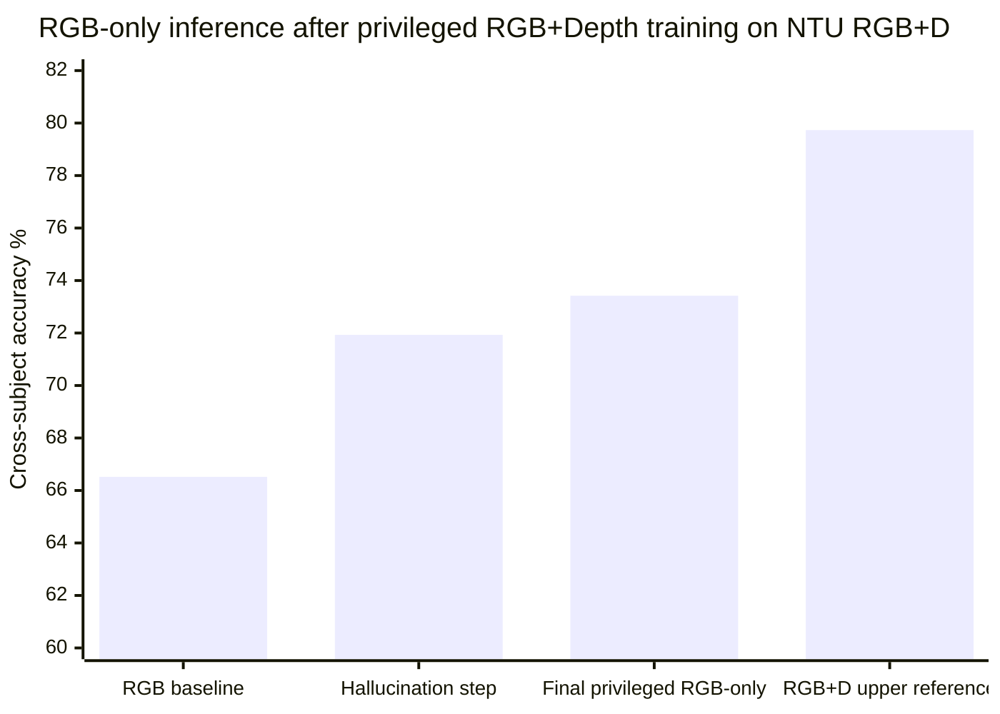
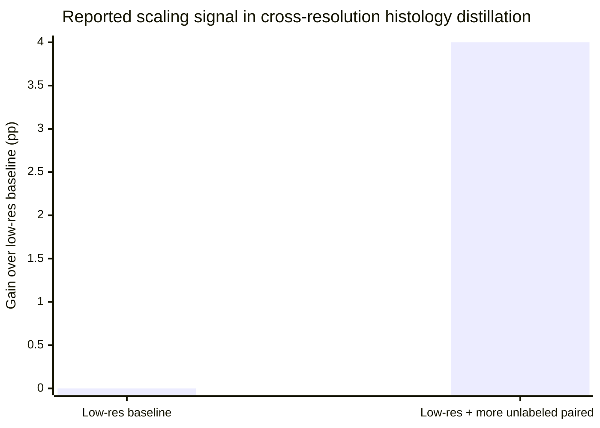

# Training With Paired Privileged Views

## Executive summary

The literature most relevant to your JetClass setup is not generic domain adaptation. It is the narrower family of methods where each training example has a paired low-quality deployed view and a richer high-quality view, but inference must run from the low-quality view alone. In the classic theory this is **Learning Using Privileged Information** (LUPI), later unified with distillation as **generalized distillation**. In the modern applied literature, the strongest variants are teacher-student distillation, feature-level hallucination or reconstruction, cross-resolution distillation, missing-modality self-distillation, and uncertainty-aware or expert-gated methods. Your uploaded setup note matches this regime exactly: HLT and offline jets are aligned one-to-one for the same jet; offline is allowed only during training; inference must consume HLT tokens only. fileciteturn0file0 citeturn32academia1turn37view0turn32academia0

Across domains, the most persuasive positive precedents come from RGB-only action recognition trained with RGB+depth, low-resolution recognition trained with high-resolution teachers, radar-only or far-field speech models distilled from richer sensing, and medical systems trained with fuller modality sets but deployed under missing-modality constraints. Reported gains are often real and sometimes large: Garcia et al. improve RGB-only NTU RGB+D action recognition from 66.52% to 73.42% cross-subject, and from 71.39% to 77.21% cross-view, by hallucinating the missing depth stream under a generalized-distillation loss; far-field ASR papers report up to 4.7 absolute WER reduction or double-digit relative WER gains from clean or close-talk teachers; recent remote-sensing work reports average gains of 4.2% in zero-shot classification and 5.9% in retrieval for RGB-only satellite inference after spectral distillation. citeturn24view3turn48view0turn49academia1turn49academia2turn39academia0

The evidence is weaker that these gains remain large when the deployed-view baseline is already extremely strong and training data are already abundant. Recent theory on privileged ERM explicitly warns that worst-case guarantees need not beat ordinary ERM unless the privileged channel has the right capacity and alignment properties, and the recent missing-modality survey notes that many papers still privilege robustness over rigorous scaling-law analysis. The clearest positive scaling evidence I found comes from digital pathology: resolution-based distillation not only narrowed the high-resolution/low-resolution gap, but also improved as more unlabeled paired data were added, including a reported 4 percentage point boost at 0.625x magnification. Still, full data-scaling curves are rare in this literature. citeturn32academia0turn37view0turn29academia0

For the HLT→offline JetClass problem, the most promising directions are, in order, **task-aware distillation from a strong offline teacher into an HLT-only student**, **set-level reconstruction of an offline-like particle view with downstream teacher consistency**, **HLT-only conditional experts whose specialization is shaped by offline teacher uncertainty or disagreement**, and **multi-hypothesis reconstruction followed by HLT-only fusion**. The common design principle is that offline supervision should shape the representation space, not appear anywhere in the deployed path. The ablations that matter most are shuffled-pair controls, parameter-matched HLT-only controls, strict train/val only teacher-logit use, frozen corruption caches, and stacking only on held-out prediction splits. fileciteturn0file0 citeturn48view1turn48view3turn27academia0turn45academia3turn37view0

## Framing the setup and the method taxonomy

LUPI was introduced to formalize supervised learning in which each training example has an additional privileged channel that is absent at test time. Generalized distillation then made the connection to teacher-student learning explicit: a teacher can either use extra features, extra modalities, or both, and a student is trained to imitate the teacher while using only the deployable input. Recent theory is more cautious than early enthusiasm: privileged information can help, but it does not automatically improve worst-case sample complexity, especially if the privileged view is too rich or poorly aligned with the deployable view. citeturn32academia1turn32academia0

The modern missing-modality literature is broader than strict LUPI, but the taxonomy is useful for your problem. The recent survey by Wu et al. separates methods into **modality imputation** versus **representation-focused methods**, and also into **architecture-focused** versus **model-combination** strategies. In your language, those buckets align well with reconstruction of offline-like jets, teacher-logit distillation, latent or feature-space alignment, conditional fusion, and held-out stacking. citeturn37view0

For JetClass specifically, the key implication of your setup note is that this is a **paired privileged-view** problem, not a standard multimodal deployment problem. The offline jet is matched to the same HLT-like jet on the same row, and only the HLT view may appear on the inference path. That makes pair-aligned methods much more relevant than loose co-training or unpaired domain adaptation, and it makes leakage control unusually important because the privileged view is so semantically close to the target. fileciteturn0file0

The top four families in the literature can be summarized this way:

```mermaid
flowchart LR
    A[Paired training sample<br/>low-quality view h + privileged view o + label y]
    A --> B[Teacher-student distillation]
    A --> C[Hallucination or reconstruction]
    A --> D[Missing-modality robust representation]
    A --> E[Conditional experts and uncertainty-aware routing]

    B --> B1[Teacher T(o)]
    B1 --> B2[Student S(h)]
    B2 --> B3[Inference uses h only]

    C --> C1[Reconstructor R(h) predicts ŏ]
    C1 --> C2[Classifier C(h, ŏ) or C(ŏ)]
    C2 --> C3[Inference uses h only]

    D --> D1[Mask, drop, or align modalities during training]
    D1 --> D2[Shared latent space or self-distillation]
    D2 --> D3[Inference on available subset only]

    E --> E1[Experts specialize using privileged supervision]
    E1 --> E2[Gate trained on deployable input]
    E2 --> E3[Inference uses h only]
```

That flowchart is a direct abstraction of the families discussed in generalized distillation, RGB-D hallucination, recent missing-modality medical work, and uncertainty-aware adaptation papers. citeturn32academia1turn19view0turn37view0turn45academia3

## Representative precedents across domains

The table below focuses on papers that are either strict matches to the paired privileged-view regime or very close analogues. Citations are to the primary paper pages and, where available, result tables or abstracts with numerical outcomes.

| Representative study | Setup and dataset | Train-time vs inference-time modalities | Architecture and objectives | Reported outcomes and scale evidence |
|---|---|---|---|---|
| **Garcia, Morerio, Murino, ECCV 2018** | Video action recognition on **NTU RGB+D**. RGB is the deployable view; depth is privileged. | **Train:** RGB + depth. **Infer:** RGB only. | ResNet-50 RGB stream, depth teacher stream, and hallucination stream with multiplicative cross-stream connections. Loss combines cross-entropy, generalized distillation with soft and hard labels, and Euclidean feature-map matching. citeturn19view0turn48view1turn48view2 | RGB-only baseline was **66.52% / 71.39%** cross-subject/cross-view. Final privileged RGB-only model reached **73.42% / 77.21%**, a gain of **+6.90 / +5.82 points**. The intermediate hallucination model reached **71.93% / 74.10%**. No training-data scaling sweep was reported. citeturn24view3turn48view0 |
| **Ge, Yu, Lee, 2023** | Low-resolution face recognition on **AgeDB-30** with high-resolution faces as privileged teachers. | **Train:** HR face images plus paired LR images. **Infer:** LR images only. | Feature knowledge distillation from an HR-trained network to an LR network using cosine-similarity feature alignment rather than standard \(L_p\) feature losses. citeturn50academia2 | The paper reports a **3% improvement over the previous state of the art** on AgeDB-30 while maintaining strong HR performance. No dedicated scaling curve was reported. citeturn50academia2 |
| **DiPalma et al., 2021** | Digital pathology and histology classification on **celiac disease** and **LUAD** datasets, using high-resolution slides to teach low-resolution models. | **Train:** HR images and matching low-resolution images, plus unlabeled data for self-supervised KD. **Infer:** low-resolution only. | High-resolution teacher and low-resolution student with self-supervised cross-resolution distillation. The goal is both accuracy and computational reduction. citeturn21view1turn29academia0 | On celiac disease, the low-resolution student **outperformed the HR teacher** while using **4× fewer computations**. On LUAD at **1.25×** magnification, the student was **within 3%** of the 10× teacher while using **64× lower computation**. With more unlabeled data, the **0.625×** model improved by **4 percentage points** over its low-resolution baseline. This is one of the clearest positive scaling results in the literature. citeturn21view1turn29academia0 |
| **Yi et al., 2018** | Far-field ASR on the **AMI corpus**, using close-talk speech as the richer paired teacher view. | **Train:** close-talk teacher plus parallel far-field recordings. **Infer:** far-field speech only. | Teacher-student acoustic modeling with KL divergence between teacher and student output distributions. citeturn49academia1 | The best student achieved **up to 4.7 absolute WER reduction** relative to conventionally trained far-field baselines. No explicit training-size scaling curve was reported. citeturn49academia1 |
| **Li et al., 2018** | Production far-field speaker system with acoustic modeling and keyword spotting. | **Train:** close-talk well-trained AM plus parallel simulated far-field data; large KWS teacher compressed to smaller KWS student. **Infer:** far-field AM or small KWS model only. | Teacher-student learning for both acoustic model adaptation and KWS model compression, followed by sequence-discriminative training and live-data refinement. citeturn49academia0 | Reported **72.60%** and **57.16% relative WER reduction** for the adapted AM on playback and live tests, respectively. KWS model size was reduced by **27×** with no loss in accuracy. This is a strong precedent that richer training-time views can be monetized either for accuracy or for deployable efficiency. citeturn49academia0 |
| **Kim, El-Khamy, Lee, BridgeNets, 2017** | Distant speech recognition on **AMI**, with teacher hints from cleaner or richer speech representations. | **Train:** teacher on richer signal, student on distant/noisy speech. **Infer:** distant speech only. | Recursive student-teacher transfer with both soft-label hints and intermediate-feature hints. The recursive architecture iteratively denoises and recognizes. citeturn49academia2 | The paper reports **up to 13.24% relative WER reduction** over a baseline neural network without teacher hints. No scaling sweep is reported, but the result is notable because the gains come from richer intermediate hints, not only logits. citeturn49academia2 |
| **Bang et al., RadarDistill, 2024** | Radar-only 3D object detection on **nuScenes**, distilled from LiDAR. | **Train:** radar + LiDAR. **Infer:** radar only. | Cross-Modality Alignment, Activation-based Feature Distillation, and Proposal-based Feature Distillation. This is a feature- and proposal-level KD design rather than plain logit KD. citeturn42academia0 | Reported final radar-only performance is **20.5% mAP** and **43.7% NDS**, state of the art for radar-only detection in the paper’s setting. The abstract accessible here does not expose the exact baseline delta, but it does report significant improvements and a strong final operating point. citeturn42academia0 |
| **Liu et al., Mind the Gap, 2024** | Brain-tumor segmentation with missing MRI modalities. | **Train:** fuller MRI modality sets. **Infer:** missing-modality subsets, including hard cases. | Teacher-student knowledge distillation with **alignment to a distribution anchor**, intended to narrow the modality gap before distillation. citeturn27academia0 | The paper reports an **average gain of 1.75 Dice points** over prior missing-modality approaches across backbones. No explicit training-size scaling experiment is highlighted in the abstract. citeturn27academia0 |
| **Gong et al., AUM, 2026** | Medical multimodal learning with missing modalities on **MIMIC-IV** and **eICU**. | **Train:** multiple clinical modalities. **Infer:** arbitrary missing subsets. | Unimodal representations are modeled as Gaussians to capture aleatoric uncertainty, followed by uncertainty-aware message passing and aggregation. This is a recent example of uncertainty-aware privileged training. citeturn45academia3 | Reported gains are **+2.26% AUC-ROC** on MIMIC-IV mortality prediction and **+2.17%** on eICU over prior methods. Scaling curves are not reported in the abstract. citeturn45academia3 |
| **Do et al., SATtxt, 2026** | Remote sensing and satellite vision-language learning on **EuroSAT**, **BigEarthNet**, and **ForestNet**. | **Train:** multispectral teacher, RGB student, and language alignment. **Infer:** RGB only. | Stage 1 distills spectral priors from a frozen multispectral teacher into an RGB student through a lightweight projector. Stage 2 aligns the distilled visual space with instruction-augmented language embeddings. citeturn39academia0 | Across the three datasets, SATtxt improves **zero-shot classification by 4.2% on average**, **retrieval by 5.9%**, and **linear probing by 2.7%** over baselines. No full dataset-size scaling study is reported in the abstract. citeturn39academia0 |
| **Celik, Lopez-Paz, McDaniel, 2016** | Clinical tabular prediction for **warfarin dose** under patient privacy constraints. | **Train:** full patient features. **Infer:** only the patient-disclosed subset. | Generalized distillation with a larger teacher that can access more patient information than the deployed student. citeturn40academia0 | The student remained **only 3% worse** than the full-information model in dose accuracy, and **only 3.9% worse** in risky under- or over-prescriptions when enough non-private information remained available. This is a useful non-vision example where privileged training closes most of the full-information gap. citeturn40academia0 |
| **Lin et al., CMCD, 2024** | Cross-modality distillation benchmarked across image, sketch, depth map, and audio tasks. | **Train:** source modality plus target modality pairs. **Infer:** target modality only. | Contrastive cross-modality distillation using both positive and negative pairs; the paper also develops a generalization analysis tied to source-target distance. citeturn38view0turn38view1 | The authors report **consistent 2% to 3% gains** across modalities and tasks relative to prior label-free distillation algorithms. No explicit data-size scaling law is given, but the theory argues that cross-modality distance should control transfer quality. citeturn38view1 |

Two additional patterns deserve mention even though the accessible abstracts do not expose a single clean headline delta. **M3AE** is a representative “catch-all” medical framework that combines masked reconstruction, representative full-modal substitution, and self-distillation so that one model can handle many missing-modality subsets at inference. **Online Sensor Hallucination** is an early remote-sensing precursor that explicitly trains a hallucination branch for missing sensors in PAN-MS and HSI classification. Both are important for taxonomy, even if their web-exposed summaries are less numerically specific than the papers above. citeturn46academia2turn31academia0

A final caveat is domain coverage: under a **strict** paired richer-view/deployable-view definition, the literature is abundant in vision, speech, pathology, medical imaging, radar-LiDAR, and remote sensing, but noticeably thinner in NLP. The closest NLP analogues I found rely on explanations, metadata, or generated privileged channels rather than naturally paired higher-fidelity observations. LUGPI is an interesting recent example, but it uses text-to-image generation to create a privileged channel rather than starting from a naturally richer paired measurement. citeturn37view0turn35academia0turn36academia0

A useful visual reference point is the NTU RGB+D result from Garcia et al., because it cleanly isolates the “train on richer modality, infer on deployable modality” effect:



Those numbers come directly from the paper’s result tables and ablations. citeturn24view3turn48view0

The one representative paper that clearly shows a positive data-scaling signal is DiPalma et al. in histology, where adding more unlabeled paired data improved the 0.625× low-resolution model by 4 percentage points over its baseline:



That is not a full scaling law, but it is stronger evidence than the usual one-number benchmark comparison. citeturn29academia0

## Comparative assessment of strategy families

The table below compares strategy classes rather than individual papers. The “typical gains” column is intentionally approximate and drawn from the empirical precedents above.

| Method class | Key mechanism | Typical gains seen in the literature | Robustness to scale | Training cost | Main leakage risks | Applicability to HLT→offline JetClass |
|---|---|---|---|---|---|---|
| **Classical LUPI / generalized distillation** | Bigger teacher uses privileged input; deployable student imitates teacher outputs or targets. | Often modest to moderate unless the privileged view is strongly informative. In tabular and some multimodal tasks it can retain most of the full-information model’s benefit. citeturn32academia1turn40academia0 | **Medium.** Theory says gains are not automatic and may shrink when the privileged channel is too rich or misaligned. citeturn32academia0 | Low to medium. Mostly teacher training plus student training. | Teacher logits accidentally reused as inference features; train-test contamination through cached privileged outputs. | **Very high** as a first JetClass baseline. Offline teacher logits and features map naturally to offline-jet teachers; HLT student remains cleanly deployable. fileciteturn0file0 |
| **Output plus feature distillation** | Student matches teacher logits and intermediate features, not just labels. | Roughly **2% to 7%** accuracy gains in classification settings, **4.7 absolute WER** or **13.24% relative WER** in speech, depending on teacher gap. citeturn24view3turn49academia1turn49academia2turn39academia0 | **Medium to high** if the teacher really captures deploy-relevant information. Evidence is stronger than for plain logit-only KD. citeturn49academia2turn38view1 | Medium. Requires teacher forward passes and feature taps. | Same as above, plus risk of feature taps that implicitly depend on non-deployable inputs in evaluation code. | **Very high.** JetClass is a natural fit for offline-teacher intermediate supervision on matched jets. |
| **Hallucination or reconstruction** | Reconstructor predicts privileged-view features or a synthetic privileged modality from the deployable modality. | Can be large when the missing modality carries substantial complementary information. Garcia et al. show **+6.90 / +5.82 points** for RGB-only action recognition. citeturn24view3turn48view0 | **Unclear.** Upside is high, but optimized reconstructions can collapse to average-case reconstructions when the student baseline is already strong. Survey evidence shows many variants, but few scaling curves. citeturn37view0turn29academia0 | High. Reconstructor plus downstream classifier, often multi-stage. | Hidden privileged-path leakage is the biggest danger, especially when the reconstructed modality is checked against the true privileged modality outside train/val. | **High.** Especially compelling if translated into set-level or token-level offline-like jet reconstruction rather than image-style pixel hallucination. |
| **Cross-resolution or cross-quality distillation** | Low-quality student learns from higher-quality paired observations of the same example. | Usually **~3%** in low-resolution vision, or large compute savings with near-teacher accuracy; histology shows compute reductions of **4× to 64×** while preserving accuracy. citeturn50academia2turn21view1 | **Better than average** when the high-quality and low-quality views are tightly paired. Some evidence that extra paired unlabeled data helps. citeturn29academia0 | Medium. Often simpler than full hallucination. | Lower than reconstruction if the student never synthesizes a privileged input explicitly. | **High.** HLT versus offline is not just lower resolution, but it is an unusually close “cross-quality” pair. |
| **Missing-modality robust representation and self-distillation** | Mask or drop modalities during training, align shared latent states, distill across available subsets. | Often **~1 to 2 Dice** in medical segmentation or **~2 AUC** in medical prediction. citeturn27academia0turn45academia3 | **Medium.** Robustness is good, but these methods are optimized for many possible missingness patterns, not necessarily one fixed deployed subset. citeturn37view0 | Medium to high. Often multi-stage self-supervision plus fine-tuning. | Evaluation leakage can happen if “representative full-modal substitutes” or imputed modalities are tuned on test subsets. | **Moderate.** Useful ideas for latent alignment and subset robustness, but potentially over-general for a fixed HLT-only deployment regime. |
| **Uncertainty-aware or conditional experts** | Experts or reliability weights are shaped during training using privileged information, uncertainty, or teacher confidence; gating at inference uses only deployable inputs. | Recent papers show **+2.17% to +2.26% AUC-ROC** in clinical settings and **+7.6% / +7.9% F1** for semantically guided driving-style recognition. The literature is newer than plain KD. citeturn45academia3turn47academia1 | **Potentially high**, but evidence is still emerging and concentrated in recent preprints. | Medium to high. Additional experts, gates, or uncertainty heads. | If gates are accidentally trained or selected using privileged inputs at validation or inference time, leakage is easy to miss. | **High upside.** JetClass already has strong HLT baselines, so specialization by difficulty or uncertainty may extract gains after plain KD saturates. |
| **Multi-hypothesis generation and completion** | Build several plausible privileged reconstructions or modal completions and fuse them. | Strong recent results exist, but the literature is younger and often focused on generic incomplete multimodal learning rather than strict paired two-view deployment. citeturn45academia2turn37view0 | **Unknown.** High upside if ambiguity in the privileged view is genuine; high variance otherwise. | High. Multiple generators or experts. | Highest risk of subtle privileged contamination in training and validation loops. | **Moderate to high.** Especially attractive if a single HLT jet admits several plausible offline completions and different architectures recover different class evidence. |

The broad pattern is that **plain logit KD is usually the safest first step, hallucination or reconstruction is the highest-upside but highest-variance step, and uncertainty-aware conditional specialization is the most interesting newer direction when the deployable baseline is already very strong**. That pattern lines up well with the difficulty you described in the setup note, where direct HLT Particle Transformer baselines are already strong and simple distillation is expected to saturate. fileciteturn0file0 citeturn32academia0turn48view3turn45academia3

## Methods most promising for JetClass

I am assuming the following translation from your uploaded note: each training row consists of a matched HLT jet, offline jet, and label; inference must use only the cached HLT tokens and mask; the exact JetClass backbone is unspecified; and the main comparison is against strong HLT-only baselines and HLT-only architecture ensembles. fileciteturn0file0

**The best low-risk starting point is multi-level offline-teacher distillation into an HLT-only student.** The student should take only HLT tokens. The teacher should be a strong offline tagger trained on offline jets only. The most defensible objective is a combination of label supervision and teacher imitation,
\[
L = \mathrm{CE}(y, p_h) + \tau^2 \mathrm{KL}(p_o^\tau \| p_h^\tau) + \lambda \sum_\ell \|g_\ell(z_h^\ell) - z_o^\ell\|_2^2,
\]
where \(p_o\) and \(z_o^\ell\) come from the frozen offline teacher and \(p_h, z_h^\ell\) come from the HLT student. The Garcia action-recognition result and BridgeNets both suggest that feature-level hints and staged training can materially outperform label-only or logit-only distillation. For JetClass, the student inference path remains simply \(h \mapsto p_h\). citeturn48view1turn48view3turn49academia2turn32academia1

**The highest-upside direction is task-aware set-level reconstruction, not generic reconstruction for its own sake.** Because JetClass inputs are particle sets rather than images, the right analogue is not pixel hallucination but a reconstructor \(R(h)\) that predicts an offline-like set \(\hat{o}\) or an offline-like latent set. A reasonable objective is
\[
L = \lambda_{\text{set}} L_{\text{match}}(\hat{o}, o) + \lambda_{\text{KD}} \mathrm{KL}(T(o)\|T(\hat{o})) + \lambda_y \mathrm{CE}(y, C(h,\hat{o})) + \lambda_b L_{\text{budget}},
\]
where \(L_{\text{match}}\) could be a set-matching or Chamfer/Hungarian-style objective, \(T\) is a frozen offline teacher, and \(L_b\) penalizes implausible particle-count or energy budgets. The key lesson from the literature is that reconstruction should be **teacher-constrained and label-aware**. Garcia’s ablations show that Euclidean feature imitation alone is weaker than distillation plus harder supervision, and many medical missing-modality surveys warn that generic modality completion can waste capacity on details irrelevant to downstream discrimination. citeturn48view3turn37view0turn46academia1

**The most interesting “beyond KD” idea is HLT-only conditional experts shaped by offline uncertainty.** Several recent papers suggest that uncertainty-aware weighting or expert specialization is a good way to exploit privileged views without leaking them. For JetClass, the offline teacher can supply entropy, margin, class confusion, or disagreement labels that define expert regimes during training. A concrete design is an HLT-only MoE student with gate \(g(h)\) and experts \(f_k(h)\), trained by
\[
L = \mathrm{CE}\!\left(y,\sum_k g_k(h)f_k(h)\right) + \lambda \sum_k w_k(o)\,\mathrm{KL}(p_o \| f_k(h)) + \mu\,L_{\text{balance}},
\]
where \(w_k(o)\) is a training-time-only expert-assignment target derived from offline teacher uncertainty, not an inference feature. At inference, only the HLT gate and HLT experts remain. This is not yet as mature a literature as classic KD, but the recent uncertainty-aware clinical results and semantically guided privileged-information work make it plausible, especially when the standard HLT baseline is already strong and gains must come from better specialization rather than better raw capacity. citeturn45academia3turn47academia1turn45search4

**If a single reconstruction is too brittle, multi-hypothesis reconstruction is a plausible next step.** This is the family most aligned with your “architecture-diverse reconstructors” idea in the memo. Train several reconstructors \(R_m(h)\) with different inductive biases and some explicit diversity regularization, then distill a final HLT-only fusion model to classify from \((h,\hat{o}_1,\dots,\hat{o}_M)\). The literature here is younger and less clean than classic hallucination, but the survey and recent mixture-of-experts completion papers support the premise that missing modalities can be represented by multiple plausible completions rather than a single average one. In JetClass terms, that could matter when the HLT degradation has erased ambiguity-resolving structure, so the model should reason over several offline-like hypotheses. citeturn37view0turn45academia2

The ablations that would most convincingly prove non-leakage and parameter efficiency in JetClass are these:

- **Parameter-matched control:** compare every privileged-training method to an HLT-only baseline with the same parameter count and nearly identical optimization budget.
- **Pair-shuffle falsification:** randomly shuffle offline jets within the training split and re-run privileged training. If gains persist, the method is probably benefiting from generic regularization rather than matched privileged information.
- **Inference-path audit:** verify that predictions on stack-train, stack-val, and final test are bit-identical whether offline arrays are available on disk or physically removed from the runtime environment.
- **Teacher-only-on-train/val rule:** cache offline teacher outputs only for model-train and model-val, not for held-out fusion splits or final test.
- **Scale sweep:** report benefit at several train sizes, because the literature does not yet make it safe to assume that privileged gains grow monotonically with data.
- **Fixed-corruption control:** use the exact same cached HLT corruption across all variants. fileciteturn0file0 citeturn32academia0turn29academia0turn37view0

## Failure modes, evaluation pitfalls, and best practices

A recurring failure mode is **optimizing the wrong target**. If a reconstruction model is trained only to imitate the privileged view, it may recover visually or physically plausible structure that is irrelevant to the label. Garcia’s ablations are instructive here: a combined distillation loss beat a Euclidean-only hallucination loss, suggesting that task-aware teacher information is more valuable than generic similarity alone. In JetClass terms, this argues against maximizing offline-likeness for its own sake and in favor of reconstructors explicitly optimized for class-relevant evidence. citeturn48view0turn48view3

A second failure mode is **benefit collapse at scale**. Theoretical work on Privileged ERM shows that privileged information does not guarantee better worst-case learning, and the broad missing-modality survey makes clear that many papers still target modest-data robustness rather than strong-baseline, high-data asymptotics. This matters directly for JetClass, because your setup note already anticipates that HLT-only Particle Transformers and HLT-only architecture ensembles are strong. The implication is that methods should be chosen not only for whether they can help, but for whether they can add information that a strong HLT-only model is unlikely to learn from abundant HLT data alone. fileciteturn0file0 citeturn32academia0turn37view0

The most important practical leakage pitfall is **teacher-output misuse**. In a valid privileged-learning pipeline, teacher logits, teacher features, and privileged reconstructions are acceptable as training targets on the training and validation splits, but they must never become inference-time features. Your memo is exactly right to ban offline constituents, offline masks, and offline teacher logits on stack-train, stack-val, and final-test prediction paths. In the literature, this point is often underemphasized because many papers study robustness rather than deployment-hard constraints, but for JetClass it is non-negotiable. fileciteturn0file0

Another common pitfall is **corruption inconsistency**. If model A and model B see different degradations of the same original example, especially in synthetic low-quality setups, the privileged method may win merely because it got an easier corruption family. Your fixed cached HLT arrays and hash checks are exactly the right defense, and they are stronger than what many academic missing-modality papers report. The fair comparison is same rows, same degradation, same split roles, same inference-only view. fileciteturn0file0

The literature also suggests a subtler best practice: **separate training robustness from deployment specialization**. Catch-all missing-modality models such as M3AE are valuable when the deployable modality subset is unpredictable, but they can underperform dedicated students for one fixed subset because capacity is spent on robustness to many unavailable combinations. Since JetClass has one fixed deployment regime, HLT only, a dedicated HLT student or a dedicated HLT-to-offline reconstructor is likely to be more efficient than a model optimized to handle every possible subset of offline and HLT inputs. citeturn46academia2turn37view0

For evaluation, the strongest protocol is the one your setup note already outlines. Base models, offline teachers, and reconstructors train on **model_train**, select checkpoints on **model_val**, produce frozen held-out predictions for **stack_train**, choose fusion settings on **stack_val**, and only then report the locked **final_test**. If stacking is used, the stacker must only see base predictions from rows the base models did not train on. That rule is often violated in practice and can easily invent ensemble gains. fileciteturn0file0

The assumptions I used in this report are straightforward and all come from your memo. I assumed no fixed JetClass backbone beyond the HLT-only inference rule; I assumed the HLT and offline views are row-aligned for the same jet; I assumed the HLT corruption is cached once and shared across models; and I assumed that any valid method must improve an HLT-only deployed path rather than reintroducing offline information through the back door. fileciteturn0file0