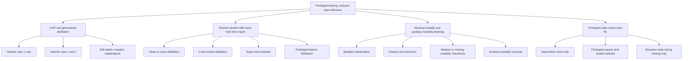

# Privileged Training with Lower-Quality Inference Inputs in Machine Learning

## Executive summary

Across a wide span of machine learning, there are indeed methods that exploit richer, cleaner, or otherwise privileged inputs during training, while requiring only reduced-quality inputs at inference. The foundational formulations are Learning Using Privileged Information (LUPI) and generalized distillation, and their descendants include privileged-feature distillation, cross-modal distillation, modality hallucination, clean-to-noisy teacher-student training, auxiliary-modality learning, missing-modality learning, and asymmetric training in reinforcement learning. In all of these, the deployment model is constrained to act on the lower-quality input \(x\), even though training had access to additional information \(z\) that is not available at runtime. citeturn17view0turn17view1turn17view2turn15view2turn16view0turn22view0

The strongest empirical evidence that privileged training can still help in very large-data settings does not come uniformly from every domain. It is strongest in industrial ranking and recommendation, large-scale speech adaptation and robustness, simulation-based robotics and RL, and some high-energy physics pipelines. Representative large-scale results include an 11.2% relative gain in NDCG@8 on an industrial Amazon ranking task via privileged-feature distillation, AUC gains plus a 2.3% online conversion lift in Taobao recommendation, up to 44% relative WER reduction in speech adaptation with 3,400 hours of unlabeled parallel data and further gains with up to 8,000 hours, real-robot success improving from 0/5 to 5/5 in three sim-to-real manipulation tasks via asymmetric training, and HEP student models that retain most of the teacher’s reconstruction gains while using far fewer resources. citeturn26view0turn15view4turn15view5turn27view0turn27view1turn27view2turn39view0turn28view0turn28view1turn20view0

The right high-level conclusion is conditional rather than absolute. If the deployment input \(x\) is already a sufficient statistic for prediction, the learner is Bayes-consistent, and optimization is not an obstacle, then privileged information should mostly accelerate learning or regularize it, and its advantage should shrink with enough data. But if \(x\) is intrinsically lossy, partial, or noisy, if labels are sparse or indirect, if optimization under partial observability is hard, or if the student architecture must infer structure that is easier to expose through a teacher, then privileged training can still help even when sample counts are extremely large. Foundational LUPI theory explicitly studies faster rates, generalized distillation frames privilege as a teaching signal that can convert a harder problem into an easier one, privileged-feature distillation gives a variance-reduction analysis using privileged features and unlabeled paired data, and recent RL theory shows polynomial sample and computational gains under training-time privileged information in partially observable settings. citeturn17view1turn17view2turn26view0turn22view0

The evidence is weaker, or at least less asymptotic, in standard vision benchmarks, healthcare imaging, and NLP. There are many positive papers, but most paired train-with-privilege, test-without-privilege studies in vision and medical imaging are still on moderate-scale benchmarks such as NYUD2, NTU RGB+D, BraTS, or specialized multimodal medical datasets. There are proof-of-concept NLP results, including text-only test-time machine translation improved by train-time visual privilege, and very recent 2026 language-model work on privileged-information distillation for agentic environments, but direct evidence in truly web-scale language settings remains much thinner than in ranking, speech, or simulator-based control. citeturn16view6turn16view5turn36view2turn14view0turn24view0turn40view0

For your setting, the practical implication is that privileged training is most promising when the higher-quality data either exposes hidden state, denoises the target, or makes the optimization landscape easier, not merely when it adds redundant detail. The most informative experimental question is not “does privilege help at all,” but “does the performance gap between x-only and privilege-assisted training persist as the amount of paired data scales by orders of magnitude?” Answering that requires scaling curves, oracle baselines, and ablations that separate logit distillation, reconstruction, auxiliary losses, and robustness to missing or degraded inputs. citeturn26view0turn33view0turn33view1turn37view0

## Precise setup and terminology

I will use the following setup throughout. At deployment, the model receives only a lower-quality or lower-information input \(x \in \mathcal{X}\). During training, each sample may additionally include privileged information \(z \in \mathcal{Z}\) and target \(y\), giving triplets \((x_i, z_i, y_i)\). The deployed predictor is always \(f: \mathcal{X} \rightarrow \mathcal{Y}\), never \(f(x,z)\). This is exactly the LUPI setup formalized by Vapnik and later unified with distillation by López-Paz et al. citeturn17view0turn17view1turn17view2

In this report, “higher quality” is broad. It includes cleaner measurements instead of noisy ones, higher-resolution or additional modalities instead of single degraded modalities, full simulator state instead of partial observations, offline or post-event features unavailable online, privileged explanations or context, and richer teacher predictions. What matters is not that \(z\) is “better” in an aesthetic sense, but that \(z\) carries information that makes training easier while remaining unavailable or too expensive at test time. This is the common thread connecting LUPI, modality hallucination, speech clean-to-noisy training, ranking with offline-only features, and asymmetric RL. citeturn17view0turn15view2turn16view0turn12view4turn22view0

A useful distinction is between three related but different regimes. In generalized distillation, the teacher is trained on privileged data alone, or mainly on privileged data, and the student learns from teacher outputs while using only \(x\). In privileged-feature distillation, the teacher uses both \(x\) and \(z\), which often produces a more learnable teacher signal for the student than using \(z\) alone. In reconstruction or hallucination approaches, the student learns to reconstruct latent features or pseudo-modalities derived from \(z\), then uses those internally at test time while consuming only \(x\). citeturn17view2turn15view2turn16view5turn35view0

The standard objective class is
\[
\mathcal{L}_{student}
=
\mathcal{L}_{task}(f(x),y)
+
\lambda\,\mathcal{L}_{distill}(f(x), g(\cdot))
+
\beta\,\mathcal{L}_{aux}(h(x), z),
\]
where \(g\) is a teacher trained with privileged information and \(\mathcal{L}_{aux}\) may regress privileged features or hallucinated modality features. In ranking, \(g\) commonly sees \(x\) and \(z\), while in clean-to-noisy speech the teacher sees clean or source-domain inputs and the student sees noisy or target-domain inputs. In RL, the “teacher” role may be played by a state-based critic or a privileged expert policy. citeturn15view2turn26view0turn39view0turn22view0

One subtle but important implication follows. Because the deployed model still maps only \(x\) to \(y\), privileged information cannot magically change the irreducible information content of the runtime input. Its role is to improve how that x-only predictor is learned, through better soft targets, variance reduction, smoother supervision, more favorable optimization, representation shaping, or latent-state exposure during training. That is why the most defensible asymptotic question is whether privileged training changes convergence, robustness, and practical asymptotes for realistic models and learning dynamics, not whether it creates test-time information out of nothing. citeturn17view1turn17view2turn26view0turn33view0

## Method landscape

The literature has grown into a fairly coherent taxonomy. The diagram below groups the main families that recur across domains, from classical LUPI to modern multimodal and RL variants. The structure is implicit in the foundational LUPI and generalized distillation papers, and is reflected in later missing-modality, auxiliary-modality, and industrial privileged-feature work. citeturn17view0turn17view2turn19search0turn15view2

Historically, the first rigorous formulation is LUPI, where a teacher provides additional information \(x^\*\) only for training examples. Pechyony and Vapnik showed that under the right correcting-space conditions, privileged ERM can enjoy substantially faster learning rates than ordinary ERM, and López-Paz et al. later unified this with knowledge distillation under the umbrella of generalized distillation. Their analysis explicitly contrasts slow \(O(n^{-1/2})\) and fast \(O(n^{-1})\) regimes, and frames privileged training as a way to make the student’s problem easier. citeturn17view1turn17view2

A major modern branch is privileged-feature distillation. Here the teacher is not trained on privilege alone, but on both regular and privileged features, then a student that only receives regular features is trained against hard labels and teacher outputs. This distinction matters empirically. Yang et al. show that generalized distillation, where the teacher uses only privileged features, can underperform the x-only baseline on public ranking datasets, while privileged-feature distillation improves over baseline and self-distillation; the reason is that teacher predictions that do not depend sufficiently on \(x\) can become unlearnable for the student. citeturn14view9turn26view0

A second large branch is cross-modal and missing-modality learning. In supervision transfer, one modality teaches another using paired data. In modality hallucination, the student learns internal features that approximate the missing modality. In auxiliary-modality learning, one or more auxiliary modalities are used at training to improve a model that deploys with fewer modalities at inference. Shen et al. provide both an optimization argument, via the idea that the auxiliary-modality model is a “supermodel” of the main-modality model, and a data argument, namely that auxiliary modalities can simplify the mapping or clarify hard cases. citeturn16view6turn16view5turn33view0turn33view1

A third branch is clean-to-noisy and domain-shift distillation. In speech, the teacher often consumes clean or source-domain speech while the student is trained on noisy or target-domain speech, using parallel but unlabeled data. This is especially relevant to your “higher quality at train, lower quality at inference” framing because the privileged input is literally a cleaner version of the same content. The speech papers are among the clearest demonstrations that these methods can remain helpful, and even become more helpful, as the amount of paired unlabeled data grows into the thousands of hours. citeturn12view4turn39view0

Finally, in RL and robotics, privileged training often means access to simulator state, hidden environment parameters, or full observations during training, while the deployed policy receives only partial observations such as images or proprioception. This is conceptually the same problem, but in a sequential decision-making setting. The empirical robotics literature and recent theory now align on the point that training-time privilege can fundamentally alter learning efficiency under partial observability, even when data can in principle be generated at scale in simulation. citeturn22view2turn22view0

## Evidence across domains and at scale

The table below focuses on papers that are either foundational, empirically important, or especially informative about the very-large-data regime. I use “large-scale” in the practical sense relevant to each domain: industrial logs, thousands of hours of speech, tens of millions of particles, or effectively unlimited simulator rollouts.

| Paper | Domain | Privileged signal used only in training | Dataset size | Large-scale | Reported improvement | Primary source |
|---|---|---|---|---|---|---|
| Vapnik & Izmailov 2015; Pechyony & Vapnik 2010 | Theory | Generic privileged information \(x^\*\) | N/A | N/A | Theory of faster learning with privileged information; correcting space can accelerate learning | citeturn17view0turn17view1 |
| Gupta et al. 2016 | Vision | RGB teacher supervises depth representation, then depth model used when labels scarce | 5K paired RGB-D video frames from NYUD2 train scenes | No | Mean AP improved from 25.1 to 29.7, then to 30.5 with adapted RGB supervisor | citeturn16view6 |
| Hoffman et al. 2016 | Vision | Depth side information, hallucinated from RGB at test time | NYUD2 RGB-D detection benchmark | No | RGB-only baseline to hallucination model: 26.6 to 30.5 mAP with AlexNet, 29.9 to 34.0 mAP with VGG-1024 | citeturn16view5 |
| Lambert et al. 2018 | Vision and NLP | Bounding boxes for ImageNet, images for MT, only at train time | 75K ImageNet images; Multi30k MT benchmark | No | ImageNet single-crop top-1 37.85 to 42.30; MT en→de BLEU 35.5 to 38.4, de→en 40.19 to 42.4 | citeturn16view3turn14view0 |
| Garcia et al. 2020 | Vision and multimodal action recognition | Depth used during training, RGB only at test time | NTU RGB+D, 56,880 videos | Moderately large | On NTU cross-view, RGB-only hallucination two-stream reached 81.50 vs prior hallucination 77.21; mixed on cross-subject | citeturn36view2turn36view3 |
| Li et al. 2017 | Speech | Clean or source speech for teacher, noisy or target speech for student | Up to 3,400 h parallel unlabeled data | Yes | On noisy Cortana, WER 18.80 to 16.11; up to 44% relative WER reduction on CHiME-3; gains increased with more unlabeled data | citeturn27view0turn27view1turn27view2 |
| Mosner et al. 2019 | Speech | Clean teacher, noisy student | Up to 8,000 h untranscribed parallel data | Yes | Best student achieved relative WER reductions of 10.1%, 28.7%, and 19.6% on clean, simulated noisy, and real test sets | citeturn39view0 |
| Xu et al. 2019 | Recommendation | Offline-only interacted or post-event features | 30-day CVR set with 2.78×10^8 users, 3.74×10^7 items, 6.97×10^7 purchases, 1.40×10^10 clicks; 60-day set even larger | Yes | PFD improved AUC by 0.0044 on 30-day and 0.0053 on 60-day CVR; online conversion improved by 2.3% | citeturn15view4turn15view5 |
| Yang et al. 2022 | Search and ranking | Position, click, add-to-cart, only offline | Industrial Amazon logs, size undisclosed; plus public ranking datasets | Yes | Multi-teacher PFD improved NDCG@8 by 11.2% over baseline; on public sets PFD improved by about 4.3% to 5.5% | citeturn26view0turn14view9 |
| Pinto et al. 2018 | Robotics and RL | Full simulator state for critic, images for actor | Simulation rollouts plus real robot transfer | Effectively yes | Real robot tasks: Asymmetric HER achieved 5/5 successes on Pick, Forward Push, and Block Move, while symmetric or BC baselines were 0/5 or 1/5 | citeturn22view2turn28view0turn28view1 |
| Cai et al. 2024 | RL theory | Training-time state or privileged signals in POMDPs | N/A | N/A | Shows practically inspired privileged paradigms can achieve polynomial sample complexity under conditions, including asymmetric actor-critic variants | citeturn22view0 |
| Bal et al. 2024 | High-energy physics | Event-level GNN soft labels, unavailable in fast student | 15 million particles | Yes | Student retained most of teacher’s gains: 6–7% improvement over Puppi for missing-transverse-momentum resolution and 12% for jets, versus teacher’s 10% and 18%; with 27× fewer parameters | citeturn20view0 |
| Rui et al. 2025 | Healthcare imaging | Multimodal MRI structure during pretraining, with missing-modality awareness | 16,022 scans, 3,755 patients, over 2.4 million images | Yes | Downstream Dice gains of 0.28% to 14.47% and classification gains of 0.65% to 18.07%; indirect but relevant evidence for large-scale multimodal privilege | citeturn24view0 |

Several domain patterns stand out. In recommendation and ranking, the large-scale evidence is unusually strong because privileged features arise naturally from system design. Offline logs contain features that are either causally downstream of ranking, such as clicks or add-to-cart, or too expensive to compute online. These features systematically improve teacher quality, and the best student performance often comes not from the most predictive teacher, but from the best learnable teacher for an x-only student. On Amazon search logs, multi-teacher PFD gave an 11.2% relative lift in NDCG@8 over baseline; on public ranking sets, PFD beat both no distillation and self-distillation, while GenD underperformed baseline. On Taobao recommendation, the data scale is extreme, and the gains persisted not only offline but in online A/B tests. citeturn26view0turn14view9turn15view4turn15view5

In speech, the large-data story is even clearer. Li et al. explicitly showed that increasing parallel unlabeled data from 375 hours to 3,400 hours improved noisy-condition WER from 16.66 to 16.11, and they concluded that increasing the amount of unlabeled data adds robustness. Mosner et al. scaled the same idea to up to 8,000 hours and still obtained substantial relative WER reductions, especially in noisy conditions. This is one of the cleanest demonstrations that privileged clean inputs can continue to help far into the high-data regime, rather than being merely a low-shot trick. citeturn27view0turn27view1turn39view0

In robotics and RL, “effectively unlimited” data often means simulation. That matters because it answers your question under perhaps the harshest possible scaling assumption. Even when rollouts can be generated at scale, training with full simulator state or other privileged environment information still improves outcomes because the sequential learning problem under partial observability is fundamentally harder than the fully or asymmetrically observed one. Pinto et al. show strong empirical gains in both simulation and real-robot transfer, and Cai et al. provide a theoretical account in partially observable RL, proving sample- and computation-efficiency guarantees for certain privileged-information paradigms. citeturn22view2turn28view0turn28view1turn22view0

In HEP, the privilege is often a heavier or slower offline model rather than a different raw modality. DistillNet is a particularly relevant example because trigger and online systems are precisely low-latency, lower-capacity inference settings. The teacher GNN uses event-level relational context that the fast student does not explicitly model, yet the student inherits most of the physics benefit while dramatically reducing parameter count and computation. This is a strong example of privileged training remaining useful even when huge offline simulated datasets are available. citeturn20view0

Vision and multimodal perception contain many successful papers, but the scale evidence is more mixed. On moderate benchmarks, supervision transfer and hallucination produce clear gains, and on NTU RGB+D there is evidence that learned missing-modality models can remain competitive on fairly large paired datasets. But compared with ranking, speech, or simulation RL, direct asymptotic studies in full-scale vision are still scarce. That scarcity is itself an important finding: the empirical literature strongly supports the setup, but not yet uniformly in the “effectively unlimited paired data” regime for standard supervised vision. citeturn16view6turn16view5turn36view2turn36view3

Healthcare shows the same pattern. There is solid literature on unimodal inference with train-time multimodal privilege, and very large multimodal medical pretraining is now appearing, but the strongest at-scale evidence often comes from pretraining and representation transfer rather than direct one-task privileged-train versus non-privileged-inference comparisons. That means the domain is promising, but the asymptotic question remains under-answered relative to ranking and speech. citeturn24view0turn5search2

For NLP, the exact setup exists but the mature large-scale literature is thinner. Lambert et al. show train-time visual privilege improving text-only machine translation at test time, and recent work on privileged-information distillation for language-model agents indicates that PI-conditioned teachers can outperform standard SFT-plus-RL pipelines even when the student must act without privileged information. Still, compared with the industrial and speech literature, the evidence base is newer and less settled. citeturn14view0turn40view0

## Why gains persist and where they fail

The most robust mechanism is variance reduction. Yang et al. analyze a linear privileged-feature setting and show that ordinary regression treats the part of label variance explainable by privileged features as noise, whereas PFD lets the teacher absorb some of that variance and then transfer a lower-variance target to the student. Their error decomposition explicitly includes a term that scales with \(n+m\), where \(m\) is the number of extra paired unlabeled samples, not just \(n\). This is exactly the sort of mechanism that can keep helping at large scale when privileged paired data are abundant. citeturn26view0

A second mechanism is optimization geometry. Auxiliary-modality models can be strict supermodels of main-modality models, so their best achievable training loss is no worse. Shen et al. go further and argue that optimization in the higher-dimensional model can offer better descent paths, which makes privilege helpful even apart from pure information content. Their data-perspective analysis also explains why privilege helps more on “hard cases,” such as night driving where depth or infrared conveys structure that RGB alone obscures. citeturn33view0turn33view1

A third mechanism is representation shaping and dark-knowledge transfer. Distillation softens supervision, encodes teacher uncertainty, and shapes class or action boundaries in ways that hard labels do not. In practice, this often acts like a domain-specific regularizer. Hinton et al. introduced this general logic for neural distillation, and later work shows that its success depends strongly on teacher-student compatibility rather than teacher accuracy alone. In privileged settings, this means that a slightly less accurate but more x-aligned teacher can outperform a more accurate but harder-to-imitate privileged teacher. citeturn18search2turn31view0turn26view0

A fourth mechanism is latent-state exposure. This is especially important in partial observability. In RL, simulator state, hidden environment parameters, or full observations can provide the critic or expert with information that makes the training problem statistically and computationally easier. The student policy then internalizes behavior that is feasible from deployable observations, even though the training signal was much richer. Recent RL theory shows that this is not just an empirical hack, but can change sample-efficiency guarantees under appropriate conditions. citeturn22view0turn22view2

There are also common failure modes. The first is that the privileged signal can be too predictive in the wrong way. Yang et al. show a non-monotone effect: as privileged features become more discriminative, the student first improves, then worsens, because the teacher begins to explain not only signal but also variance that the student cannot reliably reproduce. Their Amazon experiments match this: add-to-cart was the strongest teacher feature for purchase prediction, but not the best distillation feature for the student. citeturn26view0

The second failure mode is teacher-student mismatch. Cho and Hariharan show that larger, more accurate teachers often do not make better teachers, especially when student capacity is limited, and that sequential distillation is often ineffective. This matters in privileged-training setups because the teacher is frequently much stronger or richer than the student by design. A privileged teacher that is too far from what an x-only student can realize may simply be hard to imitate. citeturn31view0

The third failure mode is naive missing-modality robustness. On NTU RGB+D 60, Woo et al. show that standard multimodal fusion can collapse badly when modalities disappear at test time. A sum-fusion model trained with RGB, depth, and infrared achieved 93.3% with all modalities, but only 15.6% with RGB alone at test time; even a stronger transformer fusion still dropped to 56.6% with RGB only. Their results also show that regularization choices matter, with label smoothing helping and some other augmentations hurting. This is a useful reminder that “train multimodal, test unimodal” is not enough by itself. The training procedure must be explicitly designed for the mismatch. citeturn37view0

The fourth failure mode is domain-specific identifiability. Some privileged signals simply cannot be reconstructed well from the deployed input, so reconstruction-based methods may waste capacity or learn artifacts. In such settings, direct logit alignment or privileged-feature distillation is typically a better bet than trying to regenerate the missing modality. The ranking and speech results are especially consistent with this view, because they derive most of their gains from teacher supervision rather than from pixel- or feature-level reconstruction of privilege. citeturn26view0turn39view0

## Evaluation guidance for your setting

For your use case, the cleanest formal experiment is to define a paired dataset \((x,z,y)\), where \(x\) is the runtime-quality input and \(z\) is the higher-quality train-only view. Then measure the scaling gap
\[
\Delta(n) = \text{Perf}\big(f_{priv}(x; z), n\big) - \text{Perf}\big(f_{x\text{-only}}(x), n\big)
\]
over logarithmically increasing amounts of paired training data. If \(\Delta(n)\) stays positive at the largest scales you can train, you have empirical evidence that privileged training is doing more than merely helping in small-data regimes. This kind of scaling analysis is especially important because the theory and the industrial results both suggest that some gains decay, while others persist because they remove variance or partial-observability bottlenecks. citeturn26view0turn22view0

The baseline set should be stricter than what many papers use. At minimum, compare: an x-only model trained on hard labels; an oracle x+z model that measures the irreducible advantage of privileged features if they were available at inference; self-distillation where teacher and student both use x; generalized distillation with teacher on z only; privileged-feature distillation with teacher on x and z; a reconstruction or hallucination model if \(z\) is plausibly inferable from \(x\); and an explicit missing-modality robustness model such as modality dropout or masked-modality training. Without these baselines, it is hard to know whether a win comes from privilege itself, from generic KD, or from simply using a stronger teacher. citeturn15view2turn14view9turn16view5turn37view0

If your current intuition is “reconstructor versus logit alignment,” I would treat those as distinct hypotheses rather than interchangeable engineering choices. Reconstruction is most plausible when \(z\) is approximately recoverable from \(x\), for example depth from RGB in constrained settings, or clean speech from noisy speech when paired supervision is strong. Logit or feature alignment is more plausible when \(z\) reveals information that is only partially inferable from \(x\), or when you want the teacher to transfer decision structure without forcing the student to reproduce the privileged modality itself. The HEP, ranking, and much of the speech literature all point toward logit or target-space alignment being the more scalable default when privilege is informative but not fully reconstructible. citeturn16view5turn35view0turn26view0turn20view0turn39view0

Use metrics that reflect not only accuracy but also deployment quality. For classification or retrieval, report task metrics such as accuracy, mAP, NDCG, or WER, but also negative log-likelihood or cross-entropy, and calibration metrics when predictions are consumed downstream by another decision module. CTR and ranking work emphasizes calibration explicitly, and HEP and robotics examples show why resource and latency metrics matter too. I would therefore report at least one predictive metric, one calibration metric, and one inference-cost metric such as latency, FLOPs, or memory. citeturn29search1turn20view0turn28view0

Ablations should isolate the source of any gain. Useful ablations are: teacher uses z only versus x+z; hard labels only versus hard labels plus KD; reconstruction loss only versus reconstruction plus KD; varying privilege strength or corruption severity; different fractions of paired privileged samples; extra paired unlabeled data \(m\) at fixed labeled \(n\); and teacher early stopping, since overly strong or overfit teachers can worsen distillation. In recommendation-like settings, also test different privileged features separately because the most predictive privilege may not be the best distillation source. citeturn26view0turn31view0

Finally, guard carefully against leakage. In ranking and recommendation, post-click and post-add behaviors are valid privileged training signals only because they are never supplied to the online student. In many real pipelines, train-only features encode future or downstream information. That is acceptable if your goal is exactly privileged training, but evaluation must ensure that only the x-only student is deployed and that all comparisons respect the same inference-time information boundary. In practice, this is one of the easiest ways to fool yourself about large apparent gains. citeturn16view0turn15view4turn26view0

My bottom-line recommendation is this. If your runtime input is genuinely degraded relative to what you can collect or synthesize offline, you should absolutely test privileged training. Start with privileged-feature distillation if \(z\) is an offline-only feature set or a cleaner paired view, then add reconstruction or hallucination only if \(z\) appears structurally recoverable from \(x\). Most importantly, run the experiment as a scaling study rather than a single-point comparison. The literature does support persistent gains at scale, but mainly when privileged information changes the effective learning problem, not when it merely adds redundant detail. citeturn26view0turn39view0turn22view0turn20view0