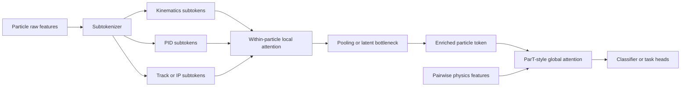
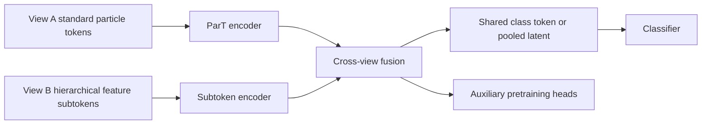

# Transformer Tokenization Choices and Hierarchical Multi-View Architectures for Particle Physics ML

## Executive summary

The literature strongly supports the premise that tokenization is not a neutral preprocessing detail. Across vision, NLP, tabular learning, and point clouds, changing the unit of tokenization changes what relations are easy or hard for a transformer to learn, what priors are baked into the model, and what compute budget is spent on. Vision work moved from single-scale patch tokens in ViT to recursive local aggregation in T2T-ViT, inner-and-outer token hierarchies in TNT, multi-scale dual branches in CrossViT, and regional-to-local attention in RegionViT. NLP work shows equally large effects when moving from subwords to bytes or characters, with byte-level models needing explicit local aggregation, downsampling, or dynamic patching to remain competitive. Tabular work is another direct proof that “features as tokens” can be useful: TabTransformer, FT-Transformer, and SAINT all operate on feature tokens rather than collapsing features with a front-end MLP. citeturn14search0turn30view4turn30view0turn30view1turn30view2turn2search4turn28view1turn28view3turn28view4turn29view0turn29view3turn31view0turn5view7turn31view2

For particle physics ML specifically, the field has already validated several adjacent ideas, but not the exact one you described. ParticleNet established that jet representation matters, and that local neighborhood structure helps on particle clouds. ParT then showed that particle-level transformer tokenization plus pairwise physics-aware attention bias is a very strong inductive bias. OmniLearn’s PET body mixes local graph-style encoding with global transformer processing. MPM and OmniJet-α show that tokenization itself has become an explicit research object in HEP foundation-model work, with VQ-based discrete particle tokens and masked/tokenized pretraining. More recent efficient models such as SAL-T and PHAT-JeT also show that hierarchical or locality-aware attention is considered promising when full quadratic attention is too expensive. citeturn26academia21turn6view1turn6view0turn8view3turn7view5turn25view4turn4search11turn25view1turn18view1turn18view0

What I did **not** find in the surveyed primary literature is a jet-tagging architecture whose central pipeline is exactly: **within-particle feature subtokens → local feature attention/pooling to one particle token → ParT-style global attention across particles with physics pairwise bias**. The closest structural matches are outside HEP, especially TNT in vision and MEGABYTE/BLT in NLP, and the closest HEP near-misses are OmniLearn PET, PHAT-JeT, and particle-token foundation-model work such as MPM and OmniJet-α. That makes your proposal look less like a reinvention and more like a plausible missing combination of ideas that other fields have already made useful. citeturn30view0turn29view0turn29view3turn8view3turn18view0turn7view5turn25view4turn25view1

The second part of your question, about combining models or encoders that differ mainly in tokenization, also has supporting precedents. CrossViT combines different patch sizes in a dual-branch transformer. MGP-STR fuses predictions from character, BPE, and WordPiece granularities. Token-level Ensembling of Models with Different Vocabularies shows that even inference-time ensembling across different tokenizations is feasible. In other words, the pattern exists, but it is usually described as **multi-scale**, **multi-granularity**, **dual-branch**, **multi-view**, or **different-vocabulary ensembling**, rather than explicitly as “ensemble of tokenizations.” citeturn30view1turn27view0turn28view0

## Cross-domain literature landscape

The cleanest way to understand your idea is to see it as part of a larger pattern: many successful transformer variants improve performance because they change **what counts as a token**, or because they add a **hierarchy** between fine and coarse tokens. The papers below are the most directly informative cross-domain precedents.

| Domain | Paper | Authors | Year | Why it matters for your idea | Key method | Link |
|---|---|---:|---:|---|---|---|
| Vision | *An Image is Worth 16x16 Words* | Dosovitskiy et al. | 2020 | Establishes the basic claim that patch tokenization alone can carry a transformer surprisingly far, making token granularity itself a first-class design choice. | Fixed non-overlapping image patches as tokens. | Paper citeturn14search0 |
| Vision | *Tokens-to-Token ViT* | Yuan et al. | 2021 | Direct evidence that naive tokenization can be suboptimal, and that recursive local aggregation before global transformer processing can improve accuracy and efficiency. | Progressively aggregates neighboring tokens to model local structure and reduce token length. | Paper citeturn30view4 |
| Vision | *Transformer in Transformer* | Han et al. | 2021 | Probably the single closest structural analogue outside HEP to your proposal. It explicitly uses local fine-grained tokens inside coarse tokens, then aggregates upward. | Sub-patches as “visual words” inside patches as “visual sentences,” with inner and outer transformers. | Paper citeturn30view0 |
| Vision | *CrossViT* | Chen, Fan, Panda et al. | 2021 | A clear example of combining multiple tokenizations of the same object in one model. | Dual-branch transformer with different patch sizes fused by cross-attention. | Paper / repo citeturn30view1turn1search14 |
| Vision | *RegionViT* | Chen, Panda, Fan | 2021 | Another close analogue: local tokens plus coarser regional tokens, with global information routed through the coarse path. | Regional tokens get global attention, then regional-plus-local local attention inside each region. | Paper / repo citeturn30view2turn14search5 |
| Vision | *TokenLearner* | Ryoo et al. | 2021 | Relevant for the bottleneck question. It shows that learned token pooling or token selection can preserve accuracy while reducing compute. | Learns a small set of adaptive tokens from dense inputs. | Paper citeturn14search1turn30view3 |
| Vision | *Multiscale Vision Transformers* | Fan et al. | 2021 | Demonstrates that hierarchical resolution changes across depth are a powerful inductive bias for dense signals. | Multiscale pyramid with changing token resolution and channel width. | Paper citeturn3search4turn30view5 |
| Sets / multimodal | *Set Transformer* | Lee et al. | 2018 | Strongly relevant to jets as sets. Also useful for thinking about learned pooling and induced latent bottlenecks. | Permutation-invariant attention with inducing points to cut complexity from quadratic to linear. | Paper citeturn31view4 |
| Sets / multimodal | *Perceiver* | Jaegle et al. | 2021 | Useful template for very large token counts: many fine tokens feeding a small latent bottleneck that performs most of the global reasoning. | Asymmetric cross-attention into a tight latent bottleneck. | Paper citeturn31view3 |
| Tabular | *TabTransformer* | Huang et al. | 2020 | Direct evidence that “features as tokens” is a productive idea, especially when feature interactions matter. | Categorical columns become contextualized feature tokens. | Paper citeturn31view0turn31view1 |
| Tabular | *FT-Transformer* | Gorishniy et al. | 2021 | Even more direct: every feature becomes a token, and the transformer reasons at the feature level of one object. | Feature tokenizer plus transformer over per-feature embeddings. | Paper citeturn5view7 |
| Tabular | *SAINT* | Somepalli et al. | 2021 | Shows that feature-token transformers can be strengthened with additional axes of attention and pretraining. | Column attention plus row attention with contrastive pretraining. | Paper / repo citeturn31view2turn2search6 |

In NLP, the strongest relevant story is that moving to finer tokens nearly always forces some kind of hierarchy or compression. Byte and character models lengthen sequences dramatically, so successful architectures usually add local fusion, downsampling, or dynamic grouping rather than simply accepting much longer flat sequences. citeturn2search4turn28view1turn28view3turn28view4turn29view0turn28view5turn29view3

| Domain | Paper | Authors | Year | Why it matters for your idea | Key method | Link |
|---|---|---:|---:|---|---|---|
| NLP | *ByT5* | Xue et al. | 2021 | Establishes the baseline byte-level question: token-free models can work, but sequence length and efficiency become central. | Standard transformer on bytes with careful compute characterization. | Paper citeturn2search4turn2search19 |
| NLP | *CANINE* | Clark et al. | 2021 / 2022 | Very close to the “fine tokens first, then compress” logic. | Character input with downsampling before deep transformer processing; optional subwords as a soft inductive bias. | Paper citeturn28view1turn28view2 |
| NLP | *Charformer* | Tay et al. | 2021 | Directly about learned tokenization inside the model rather than fixing it ahead of time. | Gradient-based subword tokenization module over bytes/characters. | Paper citeturn28view3 |
| NLP | *Local Byte Fusion* | Sreedhar et al. | 2022 / 2023 | Conceptually very close to your proposal: local low-level units should aggregate before higher-level semantics emerge. | Byte n-gram and word-boundary based local fusion before deeper reasoning. | Paper citeturn28view4 |
| NLP | *Funnel-Transformer* | Dai et al. | 2020 | General compression template: reduce token length as depth increases, then spend saved FLOPs on model capacity. | Gradual token-sequence compression with optional decoder recovery. | Paper citeturn13search2 |
| NLP | *MEGABYTE* | Yu et al. | 2023 | Very strong structural analogue. | Local model within patches, global model between patches, giving sub-quadratic scaling. | Paper citeturn29view0turn29view1 |
| NLP | *SpaceByte* | Slagle | 2024 | Another example where local boundaries or coarse markers guide when to use more global computation. | Byte-level model with extra larger blocks applied at specific bytes such as spaces. | Paper / repo citeturn28view5turn13search19 |
| NLP | *Byte Latent Transformer* | Pagnoni et al. | 2025 | Perhaps the most important recent example that tokenization can itself be dynamic and compute-aware. | Bytes grouped into entropy-based dynamic patches, with local encoders and a global latent transformer. | Paper citeturn29view3turn29view4turn29view5 |
| Multi-granularity fusion | *MGP-STR* | Da, Wang, Yao | 2023 | A direct example of combining different tokenizations of the same target space. | Character, BPE, and WordPiece predictions fused at inference. | Paper / code note citeturn12search1turn27view0 |
| Ensembling | *Token-level Ensembling of Models with Different Vocabularies* | Wicks et al. | 2025 | This is the clearest explicit answer to your ensemble question. | Inference-time only ensembling across models with different vocabularies by aligning surface forms. | Paper citeturn28view0 |

Point clouds are especially relevant because jets are particle clouds. The point-cloud literature repeatedly rediscovered the same high-level lesson: fine local structure and global set-level structure usually need different mechanisms. PCT adds local neighborhood context to a point transformer, Pointformer uses explicit local and global transformers at different scales, and Point-BERT / Point-MAE show that patch tokenization plus masked pretraining is effective for unordered 3D point sets. citeturn26search0turn32search0turn33search1turn34academia9

| Domain | Paper | Authors | Year | Why it matters for your idea | Key method | Link |
|---|---|---:|---:|---|---|---|
| Point clouds | *PCT* | Guo et al. | 2020 | Early example of transformer reasoning on point sets with explicit local context in the embedding stage. | Transformer with farthest-point sampling and nearest-neighbor support. | Paper / repo citeturn26search0turn26search8 |
| Point clouds | *Pointformer* | Pan et al. | 2020 / 2021 | Very close local-global decomposition for 3D sets. | Local transformer, global transformer, and local-global integration across scales. | Paper citeturn32search0 |
| Point clouds | *Point-BERT* | Yu et al. | 2021 / 2022 | Strong analogue to HEP tokenized pretraining. | Divide point cloud into local patches, tokenize them with a discrete VAE, mask and recover tokens. | Paper / repo citeturn33search1turn33search3 |
| Point clouds | *Point-MAE* | Pang et al. | 2022 | Reinforces that patch-level masked pretraining generalizes well on point sets. | Irregular point patches with asymmetric masked autoencoding. | Paper citeturn34academia9 |


That progression is visible in ViT → T2T-ViT / TNT / RegionViT, in byte models from ByT5 → CANINE / Charformer / LOBEF → MEGABYTE / BLT, and in point clouds from PCT → Pointformer → Point-BERT / Point-MAE. citeturn14search0turn30view4turn30view0turn30view2turn2search4turn28view1turn28view3turn28view4turn29view0turn29view3turn26search0turn32search0turn33search1turn34academia9

## Particle-physics literature most relevant to the idea

The HEP side of the literature is already rich enough to separate into four clusters: particle-cloud baselines, particle-level transformers, tokenized/foundation-model work, and efficient locality-aware transformer designs. Your proposal sits partly between the second and third clusters, with a structural overlap with the fourth. citeturn26academia21turn4search9turn4search0turn4search11turn5view3turn18view1turn18view0

| Paper / project | Authors | Year | Short summary | Key methods | Tokenization level | Hierarchy / fusion | Physics bias | Main data / tasks | Link |
|---|---:|---:|---|---|---|---|---|---|---|
| *Jet Tagging via Particle Clouds* | Qu, Gouskos | 2019 / 2020 | Established particle clouds as a natural jet representation and showed strong gains from local neighborhood message passing. | Dynamic EdgeConv with permutation symmetry. | Particle tokens | Local graph layers then global pooling | Local η-φ neighborhoods | Top tagging, quark-gluon | Paper citeturn26academia21turn21view0 |
| *Point Cloud Transformers applied to Collider Physics* | Mikuni, Canelli | 2021 | Early collider adaptation of point-cloud transformers. | Point-cloud transformer on particles with local structure support. | Particle tokens | Local context plus transformer | Point-cloud inductive bias | Collider point sets / jets | Paper citeturn26search3 |
| *Particle Transformer for Jet Tagging* | Qu, Li, Qian | 2022 | The key particle-level transformer paper. Uses particle tokens and pairwise interaction features in attention. | Particle Multi-Head Attention with pairwise bias; class attention; JetClass. | Particle tokens | Flat particle-level transformer plus class token | Explicit pairwise particle interaction features | JetClass, top tagging, quark-gluon | Paper / repo citeturn4search9turn19search6 |
| *More-Interaction Particle Transformer* | Zhang et al. | 2024 | Extends ParT by emphasizing interaction inputs while reducing parameters and FLOPs. | Modified attention with richer interaction embedding; class attention. | Particle tokens | Flat particle-level transformer | Stronger interaction-channel use | Top tagging, quark-gluon | Paper citeturn5view1turn6view4 |
| *Particle Multi-Axis Transformer* | Usman et al. | 2024 | Adds local and global spatial interactions in a ParT-like design. | Parallel multi-axis attention with pairwise interactions. | Particle tokens | Local and global interactions in a unit | Pairwise interactions | JetClass | Paper citeturn17academia17 |
| *Masked Particle Modeling on Sets* | Golling et al. | 2024 | HEP self-supervised pretraining on particle sets using discretized particle tokens. | Masked particle modeling with VQ-VAE token targets; studies ordering and permutation issues. | Discrete particle tokens for pretraining target | No within-particle hierarchy | Set invariance concerns made explicit | Jet classification, transfer, weak supervision | Paper / repo citeturn4search0turn16view0 |
| *OmniJet-α* | Birk, Hallin, Kasieczka | 2024 | First cross-task HEP foundation-model step; treats tokenization itself as central. | VQ-VAE tokenizer, generative transformer, transfer to classification. | Learned discrete jet/particle tokenization | Pretrain on tokenized jets, then transfer | Tokenization quality tied to physics fidelity | Jet generation and jet tagging | Paper / repo citeturn4search11turn15view0 |
| *OmniLearn* | Mikuni, Nachman | 2024 | Shared PET body used jointly for multiple jet tasks, with local edge creation and transformer blocks. | Feature-drop, local DGCNN encoding, transformer PET body, class token, diffusion/generation head. | Particle tokens | Local graph encoding plus global transformer; shared multitask body | η-φ neighborhoods and jet-level conditioning | JetClass pretraining, cross-task transfer, detector transfer, generation, unfolding, anomaly tasks | Paper / repo citeturn5view3turn15view1 |
| *OmniLearned* | Bhimji, Harris, Mikuni, Nachman | 2025 / 2026 | Large-scale foundation-model framework expanding OmniLearn to over one billion jets. | Updated PET architecture and training, broad downstream demonstrations. | Particle tokens | Shared pretrained body | Same PET-style locality and conditioning | Top tagging, b-tagging, anomaly detection | Paper / repo citeturn24view2turn15view2 |
| *SAL-T* | Wang et al. | 2025 / 2026 | Linear-attention jet tagger with spatially aware partitioning and local convs. | Spatial sorting, partitioned projections, lightweight 2D convolutions on attention maps, linear attention. | Particle tokens | Partitioned local structure + global linear attention | Physics-informed ordering and spatial locality | hls4ml, top tagging, quark-gluon, ModelNet10 | Paper citeturn18view1 |
| *PHAT-JeT* | Wang et al. | 2026 | Hierarchical attention for jets with local exact attention in particle patches plus global patch-token communication. | Geometric message passing, local patch attention, global patch tokens, token broadcast. | Particle patches | Yes, explicit local-to-global patch hierarchy | Detector-plane geometry | hls4ml, JetClass, top tagging, quark-gluon | Paper citeturn18view0 |

Two HEP observations are especially important for your proposal. First, ParT’s gains come from operating at the **particle** level while injecting **pairwise physics relations** directly into attention. Replacing that particle-aware attention with plain MHA drops JetClass accuracy by 1.2 percentage points and reduces background rejection by roughly 20 to 30 percent on most signals, which says the physics bias is load-bearing, not cosmetic. Second, recent HEP papers increasingly treat locality and hierarchy as design levers, especially when compute matters: OmniLearn adds local graph encoding before a transformer body; SAL-T uses spatial partitioning and local convolutions; PHAT-JeT computes exact local attention within particle groups and sends only patch summaries globally. citeturn6view1turn6view2turn8view3turn18view1turn18view0

That means the field has already accepted three claims that jointly support your premise: **particle representation matters**, **local structure matters**, and **tokenization itself matters**. What remains open is to move one level deeper and ask whether the natural units are only particles, or whether some tasks benefit from a short first stage in which the internal modalities of each particle negotiate before the jet reasons globally. citeturn26academia21turn4search9turn5view3turn4search0turn4search11

## Matches and near misses

The exact architecture you described is best written as:

```text
feature subtokens within particle
→ local within-particle attention
→ pooled enriched particle token
→ global ParT-style particle attention
```

In the surveyed literature, I did not find a paper that implements exactly that stack for jet tagging. The nearest matches fall into three groups. citeturn4search9turn5view3turn18view0turn4search0turn4search11

| Match level | Paper | Why it is close | Why it is not exact |
|---|---|---|---|
| Closest structural analogue outside HEP | *Transformer in Transformer* | Fine tokens inside coarse tokens; local reasoning first, then coarse-token reasoning. citeturn30view0 | Vision patches and sub-patches, not particle features. |
| Very close outside HEP | *MEGABYTE* and *BLT* | Local modeling within patches, global modeling across patches, plus explicit compute advantages from hierarchy. citeturn29view0turn29view3 | Sequence patches, not per-object feature subtokens. |
| Close outside HEP | *RegionViT* | Regional tokens carry global context and local tokens exchange information inside regions. citeturn30view2 | Regions are spatial image groupings, not particle-internal modalities. |
| Direct “features as tokens” precedent | *FT-Transformer* and *TabTransformer* | Treat features themselves as transformer tokens. citeturn5view7turn31view0 | There is no extra object/particle axis and no local-then-global hierarchy over entities. |
| Ensemble / multi-tokenization precedent | *CrossViT*, *MGP-STR*, *Token-level Ensembling of Models with Different Vocabularies* | Different token granularities or vocabularies are fused in one system or at inference. citeturn30view1turn27view0turn28view0 | Not applied to jets, and often fuses views at the branch or output level rather than per-entity compression. |
| Closest HEP near-miss | *OmniLearn* | Local graph encoding before transformer body; class token summarization; cross-task shared body. citeturn8view3turn24view0 | Local stage is across neighboring particles, not among subtokens of one particle. |
| Closest HEP near-miss | *PHAT-JeT* | Exact local attention inside patches, pooled patch tokens globally, plus explicit ablations of local/global stages. citeturn18view0 | Patches are groups of particles, not feature groups inside one particle. |
| Closest HEP near-miss | *MPM* and *OmniJet-α* | Make tokenization an explicit research object in HEP; discrete tokens used for pretraining and transfer. citeturn7view5turn25view0turn25view1 | Tokenization is for particles/jets in generative or masked modeling space, not internal per-particle feature subtokens. |
| Baseline HEP anchor | *ParT* | Natural particle-level object tokenization with pairwise physics bias in global attention. citeturn6view0turn6view1 | No within-particle token stage. |

The compute argument that motivated your idea is also well supported. On JetClass, ParT uses 17 particle features and typically sees jets with 10 to 100 constituents, averaging roughly 30 to 50, but many practical implementations still pad to a fixed maximum such as 128 constituents for batching. Using one global token per scalar feature would therefore inflate the attention sequence length by a factor of the feature count itself. With 128 particles and 17 features, a flat scalar-token design has 2,176 tokens and about 4.73 million pairwise attention entries per layer, compared with 16,384 for 128 particle tokens, a **289×** increase. A hierarchical two-stage version that performs only within-particle subtoken attention first would need roughly \(128 \times 17^2 + 128^2 = 53{,}376\) local-plus-global attention entries, which is still about **89×** smaller than the flat scalar-token alternative. For the 14 to 19 feature range you mentioned, the flat scalar-token cost is about **196× to 361×** larger than particle-level attention, while the hierarchical version is about **77× to 94×** cheaper than the flat scalar-token design. These are rough attention-entry estimates, not complete FLOP counts, but they capture why hierarchy is the practical sweet spot. citeturn22view3turn35calculator0turn35calculator1turn35calculator2turn35calculator3turn35calculator4turn36calculator0turn36calculator1turn36calculator2turn36calculator3turn36calculator4turn36calculator5turn37calculator0turn37calculator1

ParT’s own complexity measurements fit that story. Despite having more parameters than ParticleNet, ParT reports fewer FLOPs than ParticleNet on JetClass, while the extra pairwise-feature machinery still raises FLOPs by about 30 percent over a plain transformer version of ParT. MIParT is another sign that the field is actively trading off interaction modeling and efficiency, reporting about 30 percent of ParT’s parameters and 47 percent of its FLOPs while slightly improving benchmark accuracy. PHAT-JeT and SAL-T continue that trend from a different direction by introducing hierarchical or linear/locality-aware attention rather than staying with full all-to-all particle attention. citeturn23view3turn6view4turn18view0turn18view1

## Proposed architectures and evaluation plan

The most conservative publishable architecture is a **Hierarchical Subtoken Particle Transformer**. It preserves ParT’s most valuable ingredient, the global particle-level reasoning with pairwise physics bias, while replacing the front-end per-particle embedding MLP with a learned subtoken encoder. This is the version most directly aligned with your premise. It is also the easiest to justify from existing literature, because its pieces already exist separately in TNT, FT-Transformer, Perceiver/Set Transformer bottlenecks, ParT, and OmniLearn-style local preprocessing. citeturn30view0turn5view7turn31view3turn31view4turn6view0turn8view3



A good implementation choice is to tokenize by **feature groups**, not by every scalar from the start. For JetClass-style inputs, a natural split is kinematics, PID, and track or impact-parameter information. Each subtoken can carry a value embedding, a feature-type embedding, and a particle-group embedding that binds it to one particle. This keeps the binding problem explicit while staying much cheaper than a literal scalar-token model. The pool or bottleneck step can be as simple as attention pooling, or a small learned latent set inspired by Set Transformer or Perceiver. ParT’s pairwise interaction bias should remain in the **global particle stage**, because that is where relational jet physics is most naturally expressed. citeturn5view7turn31view0turn31view3turn31view4turn6view0

The second concrete architecture is a **Dual-view Particle Encoder**, meant to answer your multi-encoder question directly. One branch is standard ParT over particle tokens. The other branch is the hierarchical subtoken encoder above. The two branches then fuse with cross-attention or with a smaller joint head. This design is less elegant than the single hierarchical model, but it is experimentally safer because the ParT branch guarantees a strong baseline view and can stabilize training. The cross-domain analogues are CrossViT and MGP-STR, while the inference-only lower-risk analogue is different-vocabulary ensembling in NLP. citeturn30view1turn27view0turn28view0



The third architecture, more speculative but very timely, is a **Tokenization ensemble or mixture**. Here the branches differ not just in architecture but in input view: for example, one branch uses pT-sorted particle tokens with ParT, another uses geometry-sorted patches with a PHAT-JeT-like encoder, and a third might use discrete VQ tokens from an OmniJet-style tokenizer for a generative or masked auxiliary loss. This is where your “different tokenized views working together” idea becomes most explicit. The strongest justification comes from CrossViT, MGP-STR, different-vocabulary token ensembling, and HEP tokenized pretraining work. citeturn30view1turn27view0turn28view0turn25view0turn7view5

For datasets and baselines, the best immediate evaluation stack is:

| Evaluation track | Datasets | Metrics | Must-have baselines | Why |
|---|---|---|---|---|
| Core multiclass jet tagging | JetClass | Accuracy, AUC, per-class background rejection | ParticleNet, ParT, ParT-plain, OmniLearn PET, MIParT | JetClass is the large public benchmark ParT was built around and exposes full feature sets. citeturn22view3turn19search6turn24view0turn6view4 |
| Standard transfer benchmarks | Top tagging, quark-gluon | Accuracy, AUC, \(1/\epsilon_b\) at fixed TPR | ParticleNet, LorentzNet, ParT from scratch and ParT fine-tuned | These are the historically dominant transfer benchmarks for jet models. citeturn21view0turn20view4turn23view3turn10search2 |
| Efficiency-oriented track | hls4ml-style or trigger-constrained benchmarks | Accuracy, AUC, background rejection, FLOPs, peak memory, latency | SAL-T, PHAT-JeT, reduced ParT | This is where hierarchy may look best if flat scalar tokenization is too expensive. citeturn18view1turn18view0 |
| Transfer and foundation-model track | JetClass pretraining then ATLAS full-sim / CMS anomaly-style tasks | Downstream AUC, SIC where relevant, data-efficiency curves | MPM, OmniJet-α, OmniLearn / OmniLearned | This tests whether the subtoken idea improves reusable representation learning, not just single-task tagging. citeturn25view4turn25view1turn24view0turn24view2 |

The most important ablations are not optional here. They are the paper. At minimum, I would recommend: particle-token baseline vs feature-group subtokens vs scalar subtokens; fixed pooling vs attention pooling vs latent bottleneck; no physics bias vs global-only pairwise bias vs local-plus-global bias; pT order vs random order vs physics-geometry order; single hierarchical encoder vs dual-view fusion; and supervised-only training vs masked subtoken pretraining vs VQ-token auxiliary pretraining. These axes are not arbitrary. They are exactly the ones previous literature found decisive in neighboring models: ParT ablated pairwise bias and dataset scale, MPM explicitly studied discretization/permutation/ordering, PHAT-JeT ablated geometric message passing and patch-token communication, OmniJet-α made tokenization fidelity central, and OmniLearn studied transfer and feature-drop robustness. citeturn6view1turn23view0turn25view5turn25view6turn18view0turn25view1turn24view0

A practical training recipe would start with a medium-scale supervised study on JetClass subsets, because ParT already shows that model ranking and data-size effects can be seen at 2 million and 10 million jets before full 100 million training. Then move to either full JetClass supervised training or masked-pretraining-plus-finetuning. A sensible self-supervised objective is a hybrid: mask a subset of within-particle feature subtokens and predict either their original continuous values or a VQ discretization target, borrowing from MPM and OmniJet-α. If the goal is cross-dataset robustness, add OmniLearn-style feature drop so the model can survive missing PID or missing track features without retraining a new backbone. citeturn23view0turn25view4turn25view0turn8view5

On compute, it is worth being realistic. Full large-scale JetClass training is nontrivial: ParT trains on the full 100 million-jet training set for 1 million iterations with batch size 512, while OmniLearn reports 128 GPUs, local batch size 256, and up to 200 epochs on JetClass. Those are different frameworks and workloads, so they are not apples-to-apples timing references, but they are good anchors for the scale of serious full-dataset studies. A prototype study on 2 to 10 million jets and 128 particles should be possible on a much smaller cluster; a full pretraining campaign intended to compete with OmniLearned-style representation learning is a much larger undertaking. citeturn22view3turn24view0turn24view2

## Open gaps and publishable angles

The clearest gap is simple: **HEP appears not to have published the exact within-particle subtoken hierarchy you described**. That is meaningful because the component ideas are already validated separately, which lowers conceptual risk, while the missing combination still looks genuinely new. ParT validates particle-level global relational attention with physics bias. OmniLearn validates adding a local stage before a transformer body. MPM and OmniJet-α validate explicit tokenization research in HEP. PHAT-JeT validates hierarchical local/global attention in jets. The publishable question is whether the right hidden variable is not only “which particles interact?” but also “how should each particle internally organize its modalities before it interacts?” citeturn6view0turn8view3turn25view4turn25view1turn18view0

A second gap is the **binding mechanism** itself. Once features become subtokens, the model needs a way to know which subtokens belong together without baking in a fragile or overly biased ordering. The literature suggests three plausible routes, none yet settled in HEP for this use case: explicit particle-group embeddings as in your sketch; learned latent pooling or inducing bottlenecks inspired by Set Transformer and Perceiver; or carefully controlled ordering and locality schemes, which PHAT-JeT and SAL-T show can work well in practice but are not true permutation invariance. This is publishable because it turns a conceptual objection into a measurable design axis. citeturn31view4turn31view3turn18view0turn18view1

A third gap is the question of **where physics bias belongs** in a hierarchical model. ParT places pairwise physics features in particle-to-particle attention. Your proposal opens the possibility of adding physically meaningful relations one level lower, for example between kinematic and track subtokens of the same particle, or keeping all explicit physics bias at the global particle stage and letting the local stage stay modality-centric. The literature does not yet tell us which is best. MIParT, ParMAT, SAL-T, and PHAT-JeT all show that changing how inductive bias enters attention matters a great deal, but they do so within particle-level or particle-patch-level designs. citeturn6view4turn17academia17turn18view1turn18view0

A fourth publishable angle is **multi-view fusion rather than replacement**. If a single hierarchical subtoken model underperforms ParT, that does not invalidate the idea. It may simply mean that particle tokens and feature subtokens are complementary views. CrossViT, MGP-STR, and different-vocabulary ensembling all suggest that multiple granularities can become complementary inductive biases rather than competing ones. In particle physics, a very plausible outcome is that a standard ParT branch captures global object relations best, while a subtoken branch helps on cases where small internal feature interactions matter, such as heavy-flavor or lepton-rich jets. citeturn30view1turn27view0turn28view0

A fifth gap is **self-supervised pretraining at the subtoken level**. MPM masks particles and predicts discretized particle identities; OmniJet-α tokenizes jets for generation; OmniLearn and OmniLearned focus on broad reusable particle-level representations. None of these directly ask whether masking and reconstructing **feature-modal subtokens** creates a better particle representation than masking whole particles. That is especially interesting because HEP datasets often have heterogenous feature availability across domains, and OmniLearn’s feature-drop strategy already shows that robustness to missing modalities is important. A subtoken model could make that robustness a native part of pretraining instead of a data-augmentation trick. citeturn25view4turn25view1turn24view0turn8view5

The final publishable angle is practical rather than conceptual: **hierarchy may be the bridge between better inductive bias and realistic deployment**. Flat scalar-token attention is probably too expensive. But recent HEP efficiency papers are already moving toward locality-aware or hierarchical designs because full attention is hard to deploy in trigger settings. A successful within-particle hierarchy would not only be novel, it could also plug naturally into the real-time efficiency story that SAL-T and PHAT-JeT are already advancing. That makes the work interesting both scientifically and operationally. citeturn18view1turn18view0

The bottom line is that the broader literature says “yes” to both of your core intuitions. **Different tokenizations do matter**, often a lot. And **multiple tokenized views can work together**, whether through dual-branch encoders, hierarchical local-global stacks, learned bottlenecks, or even inference-time ensembles across incompatible vocabularies. What still appears open, and therefore promising, is the specific HEP instantiation: **particle-internal modality or feature subtokens, bound locally, then released into ParT-style global relational reasoning**. citeturn30view0turn30view1turn31view0turn5view7turn28view0turn6view0turn18view0turn25view1